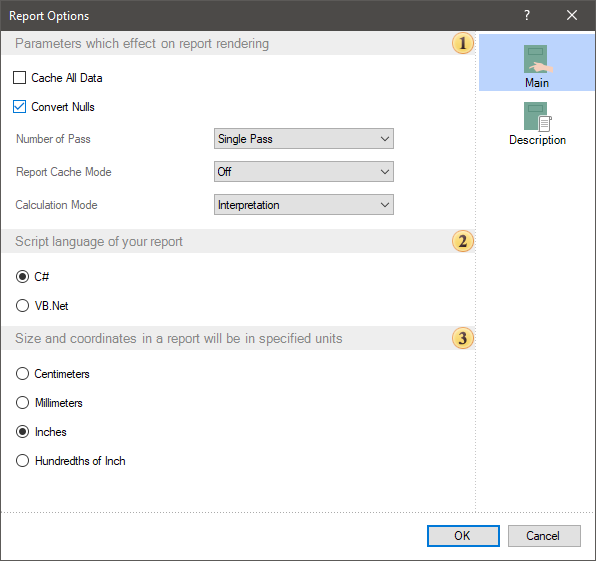
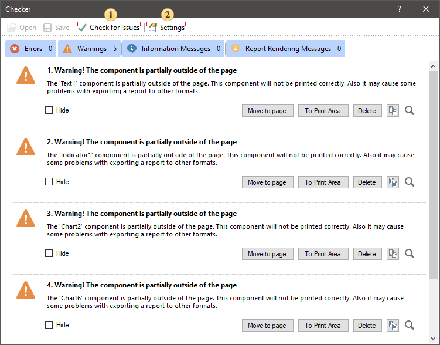
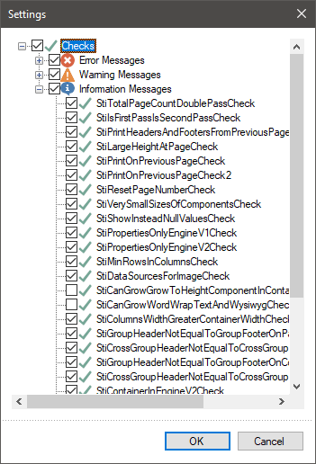

## Info

| Attention |
| --- |
| Scripts can pose a security risk. Therefore, [colculation mode](../Template/Calculation_Mode.md) are disabled in Interpretation mode. If you are confident in the security of the scripts, you can use them in Compilation mode. |

The Info section in the [File](index.md) menu contains commands for configuring, checking, and protecting the current report.

Report Settings

Selecting this command opens a window where you can configure the report template. This window displays the report template properties along with their values.

 Settings affecting report generation: Cache all data, Convert zeros, Number of passes, Cache mode, [Calculation mode](../Template/Calculation_Mode.md).

 Choosing the report script language.

 Selecting measurement units for the report.

On the Description tab, you can specify the report name, alias, author, and description. Additionally, it displays the creation date and time, as well as the last modification date of the current report.

Password Protection

When developing and saving a report, you can protect the report file with a password. To do this:

* Open or create a report in the Report Designer;
* In the Info section, select Protect Report;
* Enter a password to protect the report file;

* Select [Save](Save.md) or [Save As](Save.md). The report will then be saved as an mrx file.

The file will be encrypted. To decrypt it—meaning, to open the report in the designer or viewer—you will need to enter the correct password.

Report Checker

To check a report for errors, use the Report Checker. It analyzes the report and provides messages regarding errors, warnings, and inaccuracies found in the report.

 Check for Issues button starts the report validation process.

 Settings button opens the Report Checker settings window.

 Message panel categorizes messages into: Errors, Warnings, Information Messages, Report Rendering Messages. To enable or disable the display of a specific type of message, click the corresponding button.

In the Report Checker Settings window, you can select which checks should trigger a message if they fail. If a checkbox for a specific validation is enabled, the Report Checker will include it in the validation process. If unchecked, that validation will be ignored.

> **Information**
>
> The Check for Issues command is also available on the status bar of the Report Designer.
