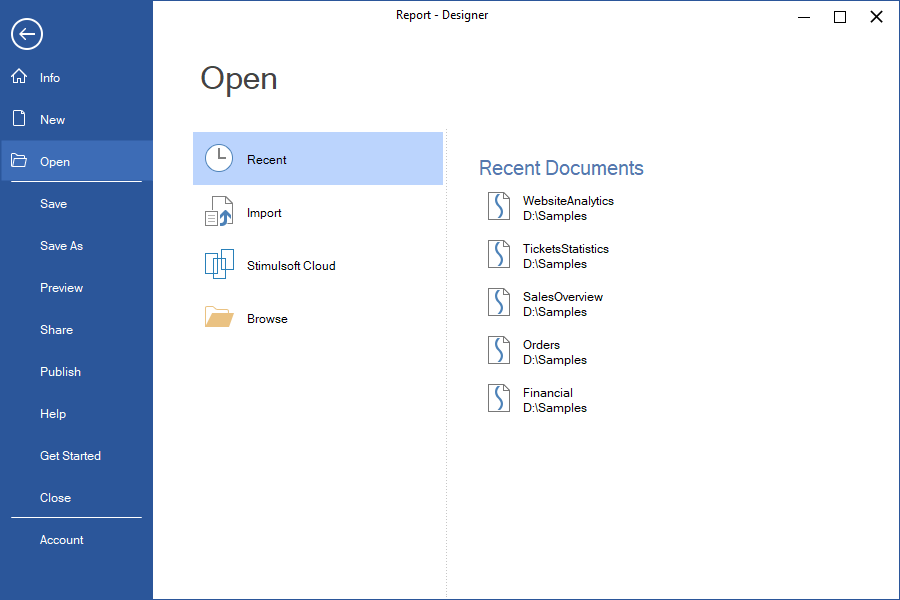
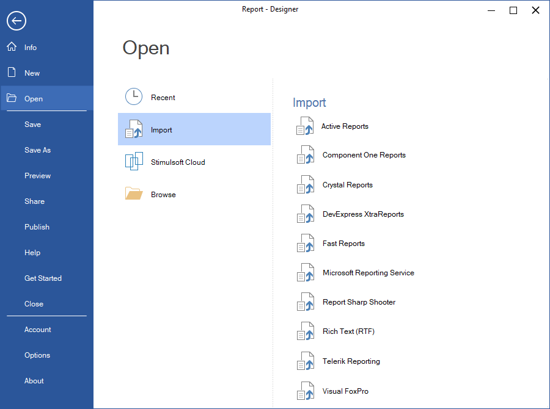
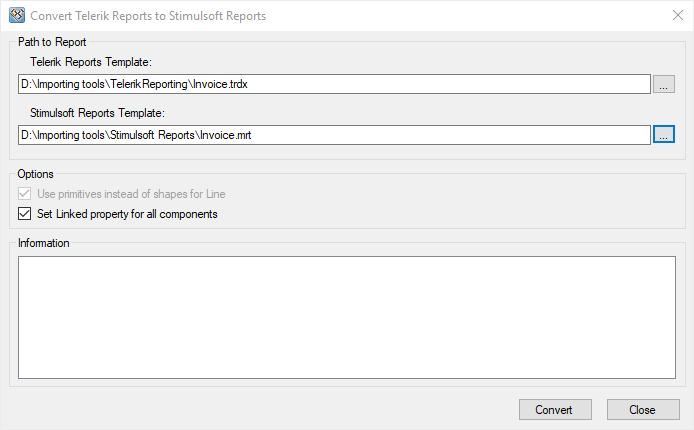
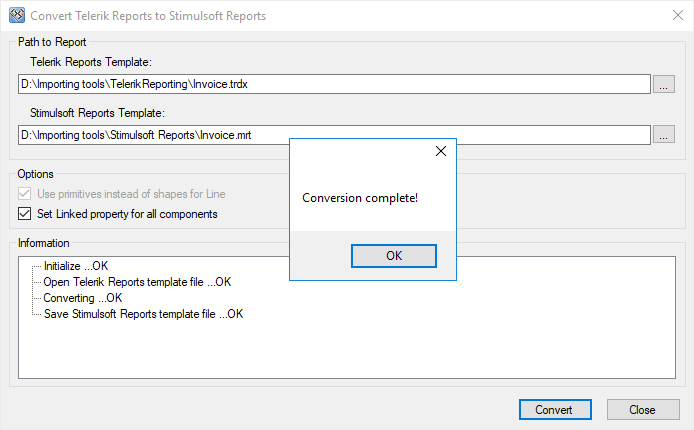

## Open

> **YouTube**
>
> Watch our [video tutorial on importing reports from Crystal Reports](https://www.youtube.com/watch?v=Xt8X6TmLxY4). Subscribe to the [Stimulsoft channel](https://www.youtube.com/user/StimulsoftVideos) to be the first to learn about new tutorials. Leave your questions and suggestions in the video comments.

The Open section in the File menu contains commands for loading reports into the designer.

A report can be loaded into the Report Designer from:
* The Recent tab, which stores links to the most recently opened reports;

* Import from other report development platforms;

* [Stimulsoft Cloud Storage](https://cloud.stimulsoft.com/);

* The user's local storage.

Report Import

Stimulsoft Reports allows importing reports from other report development platforms. The import process can be done directly in the Report Designer or using the Import Utility. To import reports in the Report Designer, go to the File menu, select Open, then Import, and choose the platform from which you want to import the report.

All imports, except those from Crystal Reports and DevExpress XtraReports, are built-in. This means reports from these platforms can be opened directly in the designer. However, for Crystal Reports and DevExpress XtraReports, reports must first be converted using the Import Utility before being opened in Stimulsoft Report Designer.

> **Information**
>
> In some Report Designers, the Import option may be missing from the Open menu. In this case, you can use the Import Utility to import reports and then work with them in Stimulsoft products.

Run the Import Utility

With the help of import utilities, you can convert reports from other reporting tools. Every file type has its own import utility. To run the import utility, follow the steps below:

Step 1: Open the web browser and go to [https://github.com/stimulsoft/Importing.Tools](https://github.com/stimulsoft/Importing.Tools)

Step 2: Download the archive with the import projects and unpack it.

Step 3: Use the development environment, such as Visual Studio, to compile the project.

Step 4: Select the reports that you want to convert to Stimulsoft reports and specify the location where the converted report should be saved.

Step 5: Click the Convert button. The result of the conversion will be displayed to the user.

Use converted reports in Stimulsoft products.

Import Report from Crystal Reports

The utility converts the Crystal Reports templates (*.rpt-files) to the Stimulsoft Reports report templates format (*.mrt-files). The tool is supplied as the C# source code only and requires referencing of some Crystal Reports runtime libraries to be built successfully in Visual Studio 2010, .NET Framework 4.0 or higher. Please download the archive from the link below, unzip it and open in the Visual Studio. The project will be built successfully, once all the required dll libraries are referenced and found in Visual Studio.

Download the archive from the link below, extract its contents, and open the project in Visual Studio.

The project was created in a way that all the required assemblies would be automatically taken from the GAC (Global Assembly Cache). If * .dll libraries of Stimulsoft Reports are not in the GAC, they will be added to the project from NuGet automatically. If you do not have an Internet connection, you should manually add **Stimulsoft.Base.dll** and **Stimulsoft.Report.dll** to the project.

The Crystal Reports report templates’ file format is a proprietary format. Therefore, the tool requires some Crystal Reports special managed assemblies. The tool interacts with these assemblies via some special Crystal Reports interfaces for the special Visual Studio managed dlls.

These assemblies are not always installed in the system together with Crystal Reports, usually the additional and an official installation of these assemblies is required in order for them to work correctly with the import tool.

For example, for Crystal Reports 2013 the Support Pack (developer version for VS: Updates & Runtime) is required and needs to be installed first, and only after that the import tool will be built successfully.

The current Crystal Reports version requires the additional installation of the ‘SAP Crystal Reports runtime engine’ (32 bit or 64 bit). The automatic installer will copy the required assemblies to the GAC. But this installer must be downloaded separately, it is not a part of the standard Crystal Reports installation package.

The project uses the following Crystal Reports assemblies:

CrystalDecisions.CrystalReports.Engine
 CrystalDecisions.ReportAppServer.DataDefModel
 CrystalDecisions.ReportAppServer.ReportDefModel
 CrystalDecisions.Shared
 CrystalDecisions.Web
 CrystalDecisions.Windows.Forms

These assemblies are not included with the tool. The packages will not work if they are just referenced and copied to the project without the proper installation by the Crystal Reports’ official installer first.

Please find the explanation of the required installations:

| Operational system | Platform Target, CPU | Installation package requirements |
| --- | --- | --- |
| Windows x32 | Any CPU | ‘SAP Crystal Reports runtime engine 32 bit'. |
| Windows x64 | Any CPU | ‘SAP Crystal Reports runtime engine 64 bit'. |
| Windows x64 + runtime engine x32bit | X86 | not required |
| Windows x64 + runtime engine x32bit | Any CPU | ‘SAP Crystal Reports runtime engine 64 bit'. |

The above mentioned installers can be downloaded using the following links:

[http://www.crystalreports.com/crvs/confirm/](http://www.crystalreports.com/crvs/confirm/)

[http://downloads.businessobjects.com/akdlm/cr4vs2010/CRforVS_redist_install_32bit_13_0_20.zip](http://downloads.businessobjects.com/akdlm/cr4vs2010/CRforVS_redist_install_32bit_13_0_20.zip)
[http://downloads.businessobjects.com/akdlm/cr4vs2010/CRforVS_redist_install_64bit_13_0_20.zip](http://downloads.businessobjects.com/akdlm/cr4vs2010/CRforVS_redist_install_64bit_13_0_20.zip)

Please read more about the requirements of those additional installations in the official reply from the Crystal Reports:

[https://archive.sap.com/discussions/thread/3675145](https://archive.sap.com/discussions/thread/3675145)

Run Crystal Reports on client machine without install runtime package?

No, the only way to make your app work is to run one of the redist packages on the user’s PC. We don't support nor do we have a way to manually deploy the runtime. Too many Registry entries and registering of the dll's to do this manually.

Parameters of Import Utility

Use primitives instead of shapes for the Line and the Box

If the flag is not enabled then the Line and the Box components will be converted to ordinary primitives (shapes, VerticalLine/HorizontalLine, and Rectangle/RoundedRectangle). If the flag is enabled then the Line and the Box components will be converted to special primitives (VerticalLinePrimitive/HorizontalLinePrimitive and RectanglePrimitive/RoundedRectanglePrimitive). When viewing/printing reports, there are no big differences between graphic and special primitives. Graphic primitives are exported as images when exporting. So it is easier to work with special primitives. But, due to Crystal Reports peculiarity, special primitives cannot work correctly on complex reports. This is why there is the ability to select the option.

Use functions for Formula Fields

In each Formula Field either expression or a data string can be placed. Each Formula Field is converted into the variable in the data dictionary. If the "Use functions for Formula Fields" flag is enabled, then the "Function" flag is set to variable. In other words, when report rendering, Stimulsoft Reports will use the value of a variable as an expression and will try to calculate the value of this expression. If the "Use functions for Formula Fields" flag is not enabled, then the value of a variable will be used as the data string.

Problems with conversion

One of the main problems in conversion is that not all object properties are available when working with managed dll. The second problem is the different reporting tools structures, such as data structures, work with bands etc. Therefore, it is not always possible to convert a report automatically, and it is required to correct a report manually.

**DataBase**:

Crystal Reports often uses their internal libraries when working with data bases. It is possible to get only some properties from .NET and it is impossible to get ConnectionString. So, not all data bases can be identified. By default, for not identified data bases, the StiOleDbDatabase type and ConnectionString template without specifying the provider is used.

**DataBases**:

In Crystal Reports, each report or subreport maintains its own separate data dictionary, which allows the same database to be represented differently across subreports. In contrast, Stimulsoft Reports utilizes a unified, global data dictionary, where all data sources are merged. If the same database appears multiple times across reports or subreports, duplicate entries are eliminated from the unified dictionary.

**Image**:

For images, it is possible to retrieve their dimensions and positioning, but it is not possible to extract the image content itself (if the image is embedded within the template).

**FormulaField**:

Expressions and formulas can be placed in these fields. On the current moment, parsing and syntax of these expressions are written “as is”. So in many cases further manual correction is required.

{Crystal Reports allows using expressions and formulas in FormulaFields. On the current moment parsing and syntax conversion cannot be done, expressions are written 'as is'. Therefore, in many cases, it is required further manual correction of expressions.}

> **Information**
>
> In Report SharpShooter v2.0+, the internal report template file format was changed, and the import utility was designed specifically for this new format. Older format files previously converted as blank reports. A minor improvement has been made, so they now convert partially. However, the best approach is to resave old reports in the new format before importing them.
