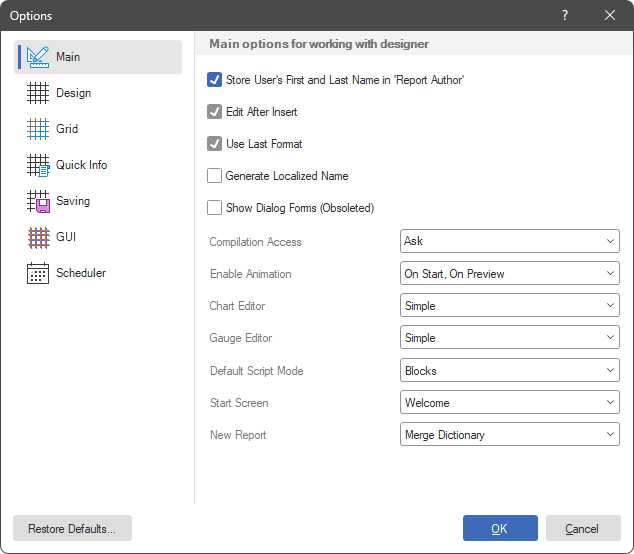
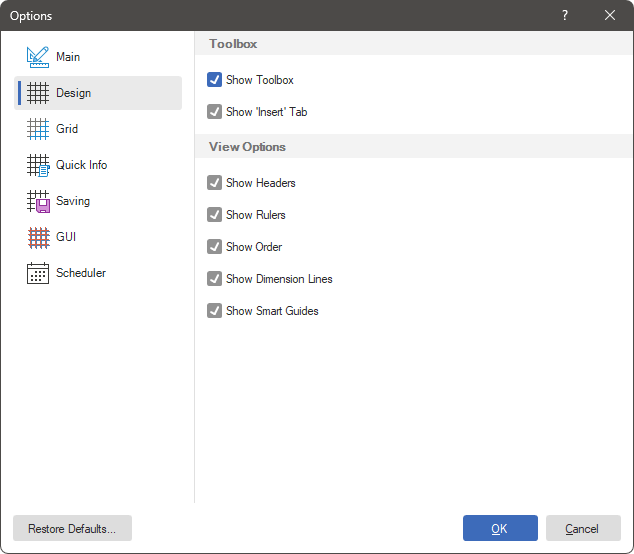
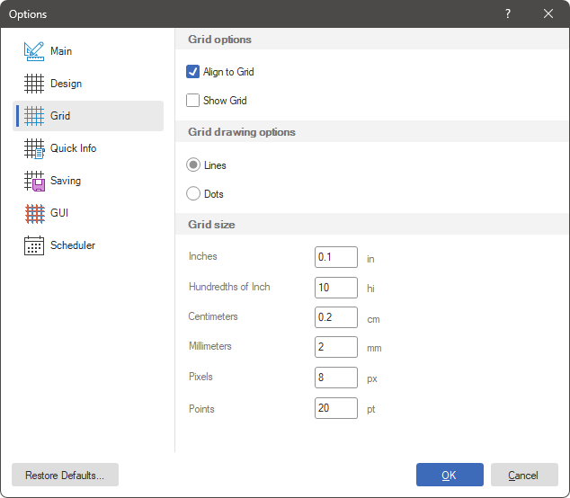
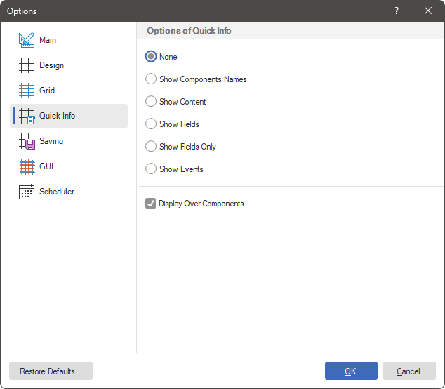
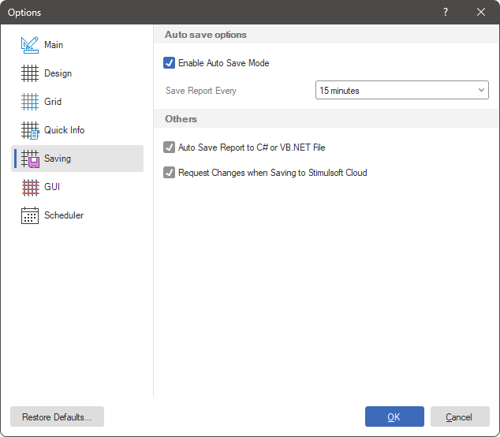
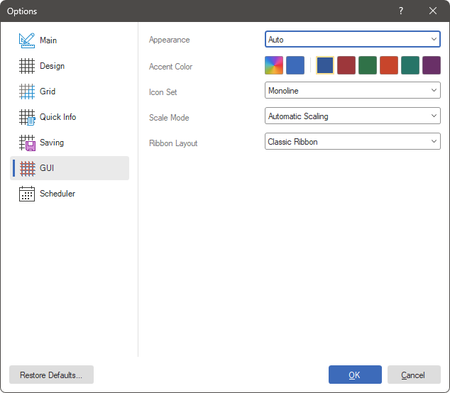
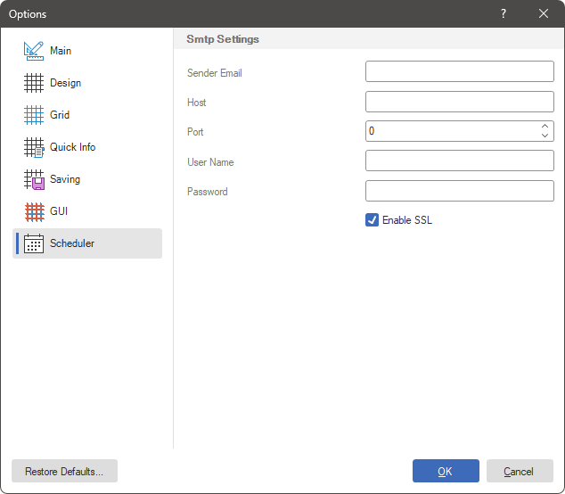
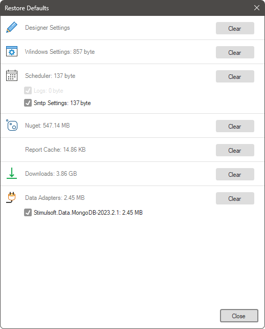

## Options

| **Notice** |
| --- |
| Scripts may pose a security risk. Therefore, they are disabled in [calculation mode](../Template/Calculation_Mode.md) such as **Interpretation**. If you are confident that your scripts are safe, you can use them in **Compilation** [calculation mode](../Template/Calculation_Mode.md). |

When you select the **Options** command from the File menu, the report designer settings editor will be invoked. All designer settings are grouped into tabs. Let's look closer at these tabs and the parameters located on them in more detail.

The **Main** Tab

Contains basic settings for the report designer.

Below, you can find a list of parameters for the current tab in the **Options** menu.

| **Name** | **Description** |
| --- | --- |
| Use User's First and Last Name in 'Report Author' | Sets the first and last name of the current user account as the value of the **Report Author** property. |
| Edit After Insert | Calls the component editor when adding it to a report. If this parameter is checked, the component editor will be called. If the checkbox is cleared, the editor will not be called. |
| Use Last Format | Uses the latest component design settings when adding new components of the same type. If this option is checked, then when adding a new component, the latest design settings of a component of the same type will be applied to it. If the checkbox is cleared, a new component will be added with default design settings. |
| Generate Localized Name | Displays localized component names in the report designer. If this option is checked, component names will be localized and displayed in the report designer. If the checkbox is cleared, the names will not be localized and the original names of the components will be displayed. |
| Show Dialog Forms | Displays Dialog forms in the Report Designer. If this option is checked, you can create dialog forms in the report. If the checkbox is cleared, the elements for creating dialog forms will not be displayed. |
| Compilation Access | Defines the security behavior when opening a template with the **Compilation** calculation mode in the report designer. |
| Enable Animation | Defines the animation mode in the report components when building and viewing it. |
| Chart Editor | Selects the type of editor for the Gauge component: **Simple** or **Advanced**. |
| Gauge Editor | Selects the type of editor for the Gauge component: **Simple** or **Advanced**. |
| Default Script Mode | Defines the type of scripting in report and component events - **Code** or **Blocks**. In **Interpretation** mode, scripting in C# or VB.Net is not available for security reasons. |
| Start Screen | Defines the report designer start settings: **Welcome**, **Blank Report**, **Blank Dashboard**. |
| New Report | Defines the behavior of the data dictionary when creating a new report - Create a new data dictionary or Merge data dictionary. |

The **Design** Tab
This tab defines the visual design options for the report designer and report viewing.

 The **Toolbox** group is used to enable the display of the Insert or Toolbox tab;

 The **View Options** group is used to define options when viewing a report.

Below is a list of parameters for the current tab in the **Options** menu.

| **Name** | **Description** |
| --- | --- |
| Show Toolbox | Enables the display of the toolbox in the report designer. If this option is checked, the toolkit will be displayed. If the checkbox is cleared, the toolkit will not be displayed. |
| Show 'Insert' Tab | Enables display of the Insert tab in the report designer. If this option is checked, the Insert tab will be displayed. If the checkbox is cleared, the Insert tab will not be displayed. |
| Show Headers | Enables the display of report component headers. If this option is checked, the headers will be displayed. If the checkbox is unchecked, the headers will not be displayed. |
| Show Rulers | Enables the display of rulers in the report designer. If this option is checked, the rulers will be displayed. If the checkbox is unchecked, the rulers will not be displayed. |
| Show Order | Enables the display of the report component serial number. If this option is checked, the sequence number will be displayed. If the checkbox is cleared, the serial number will not be displayed. |
| Show Dimension Lines | Enables the display of dimension lines in the report designer. If this option is checked, dimension lines will be displayed. If the checkbox is cleared, dimension lines will not be displayed. |
| Show Smart Guides | Displays smart guides which simplify the process of joining components. This is especially true when the mode for aligning components to the grid is disabled. |

The **Grid** Tab

This tab defines the grid settings on the report page or workspace in the dashboard.

 The **Grid Options** group includes the following parameters:

* **Align to Grid** snaps the report component to the grid;

* **Show Grid** disables/enables the grid display.

 The **Grid** drawing options parameter specifies how the grid will be displayed as **Lines** or **Dots**;

 The **Grid size** group is used to set grid sizes in different units.

The **Quick Info** Tab

This tab defines the parameters for displaying information in report components.

Below is a list of parameters for the current tab in the **Options** menu.

| **Name** | **Description** |
| --- | --- |
| None | If you set it to None, the report components will not display any information. |
| Show Components Name | If this value is enabled, then the report components will display their names. |
| Show Content | If this value is enabled, the report components will display their contents. |
| Show Fields | If this value is enabled, the report components will display their contents. |
| Show Fields Only | If this value is enabled, only column names will be displayed in report components. |
| Show Events | If this value is enabled, report components will display their used events. |
| Display Over Components | Enables displaying quick information in the foreground of the component. If the checkbox is checked, the information will be displayed in the foreground of the component. If the checkbox is not checked, then the component information will not be displayed in the foreground. |

The **Saving** Tab

This tab contains options that are used to configure the saving of the report.

Below is a list of parameters for the current tab in the **Options** menu.

| **Name** | **Description** |
| --- | --- |
| Enable Auto Save Mode | Enables the report autosave mode. |
| Save Report Every | Specifies the period of time after which the report is automatically saved. |
| Auto Save Report to C# or VB.NET File | Enables auto saving of the report as a source file. If this option is checked, then when saving the report, the source file will also be saved. If the checkbox is cleared, the source file will not be saved. |
| Request Changes when Saving to Cloud | Enables the display of the changes window when saving to Stimulsoft Cloud storage. If this option is checked, a changes window will be displayed when saving the report to cloud storage. If the checkbox is cleared, the changes window will not be displayed. |

The **GUI** Tab

On this tab, you select the type and color scheme of the report designer interface.

Below is a list of parameters for the current tab in the **Options** menu.

| **Name** | **Description** |
| --- | --- |
| Appearance | Selects a design theme in the designer and report viewer - **Light** or **Dark**. At the same time, the **Auto** value is also available, in which the theme is determined in the operating system settings. |
| Accent Color | Specifies an accent color in the report designer. There are preset colors, and a user-selectable color is also available. |
| Icon Set | Selects a set of icons for commands and controls in the report designer. |
| Scale Mode | Sets the scalability parameter for displaying controls in the report designer - 100% or Autoscale. When the autoscale is set, the value will be obtained from the operating system settings. |
| Ribbon Layout | Specifies the Ribbon mode of the toolbar - classic or UI in one line. |

The **Scheduler** tab

When using the scheduler, for some actions it is necessary to define the SMTP service settings. This is done on this tab.

Below is a list of parameters for the current tab in the **Options** menu.

| **Name** | **Description** |
| --- | --- |
| Sender Email | Indicates the sender's email address. |
| Host | Specifies the host of the SMTP server. |
| Port | Specifies the port of the SMTP server. |
| User Name | Specifies a username for the SMTP server account. |
| Password | Specifies a password for the SMTP server account. |
| Enable SSL | Enables to use encryption when connecting to the SMTP server. |

**Restore Default**
The **Restore Default...** command is used to reset various user settings. To do this, execute the **Clear** command for those settings that need to be removed.

