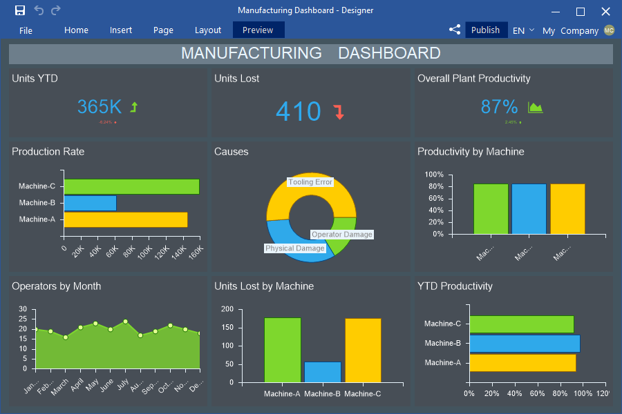
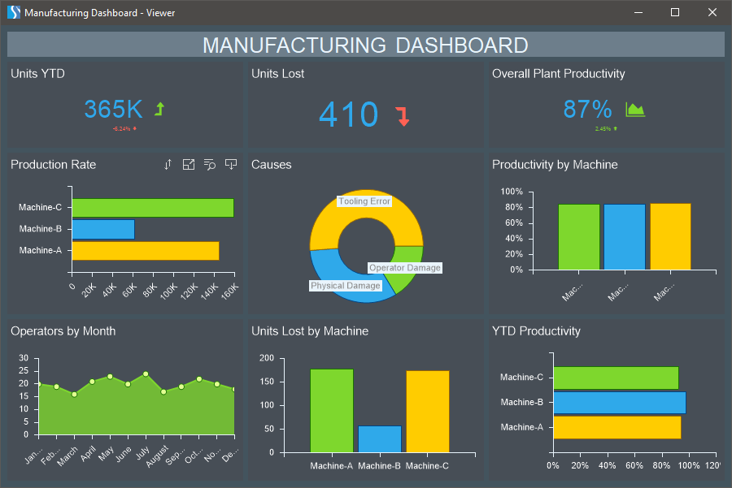

## Preview

Stimulsoft Designer allows previewing a report before printing, exporting, sending via Email or any other action, to identify possible errors. Clicking the Preview tab it is possible to preview a report or dashboard.

You can also preview the report in the separate window by using the F5 shortcut key or selecting Preview from the File menu.

> **Information**
>
> It is worth noting that the report or dashboard preview tab can be customized. For more details, refer to the [Preview settins](../Template/Preview_Settings.md) chapter.
>
>
> You can learn about all commands and controls of the viewer in the corresponding chapters: When [viewing a report](../../Viewer/Reports/index.md) and when [viewing a dashboard](../../Viewer/Dashboards.md).
