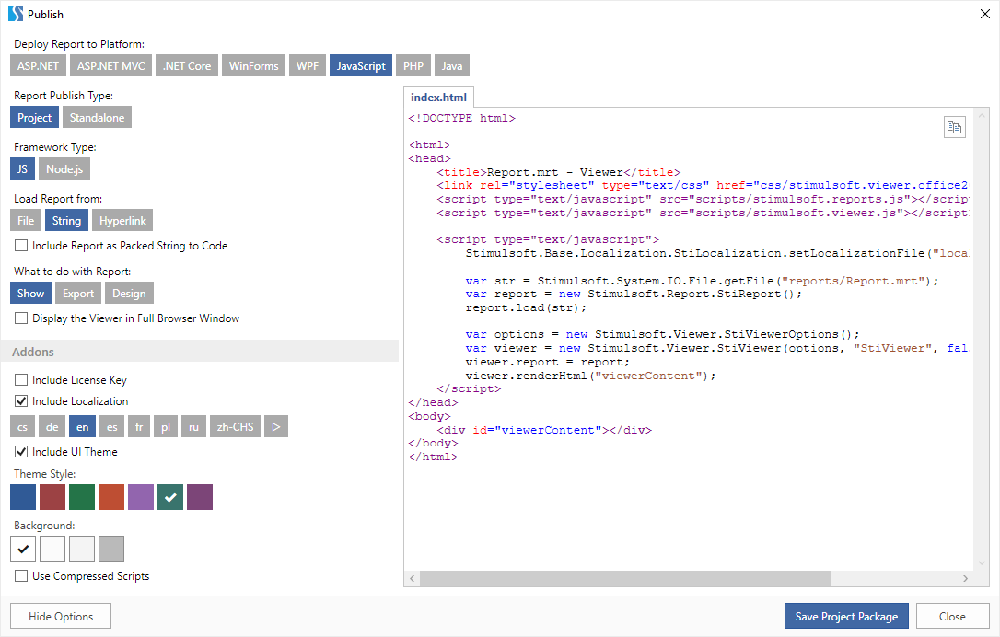
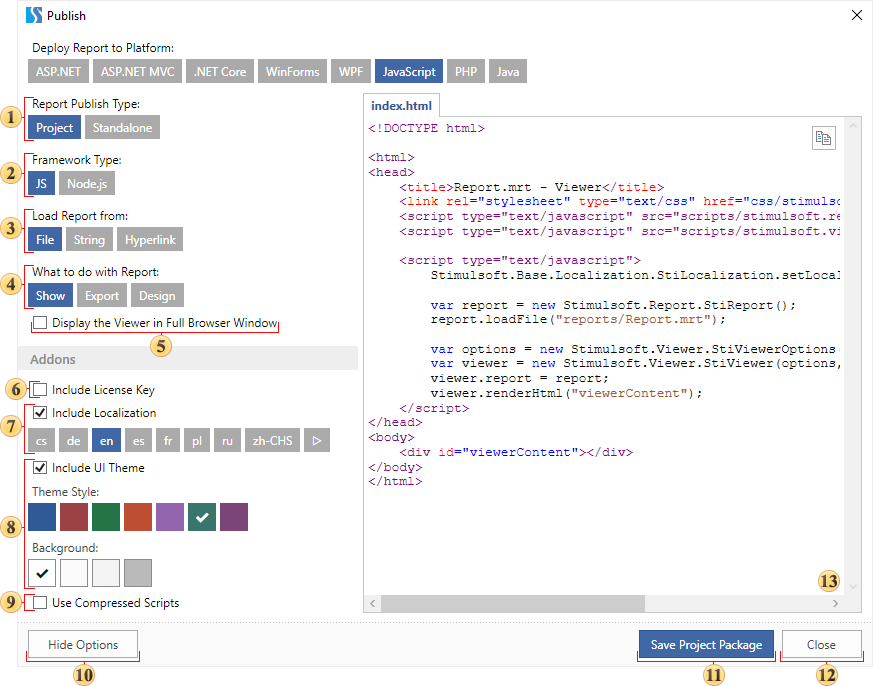
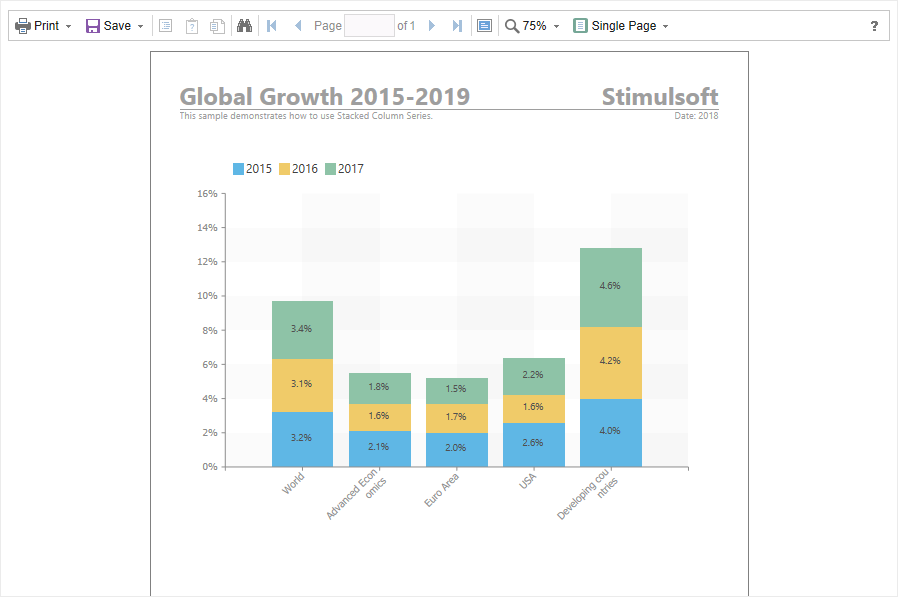

## Publish

| Important |
| --- |
| Scripts can be a security risk, so they are disabled in the [Interpretation mode](../Template/Calculation_Mode.md). However, if you are confident in the safety of your scripts, you can use them in the [Compilation mode](../Template/Calculation_Mode.md). |

> **YouTube**
>
> Watch our videos [to learn how to publish reports](https://www.youtube.com/watch?v=ke-tLkCMQA0). Subscribe to the [Stimulsoft channel](https://www.youtube.com/user/StimulsoftVideos) and be the first who watches new video tutorials. Leave your questions and suggestions in the comments to the video.

Publishing reports means saving them as separate projects or files to simplify and speed up the process of embedding these reports into an application on different platforms. The report is published using a wizard that can be called by clicking the **Publish** button on the Ribbon panel of the designer, or by selecting this command from the **File** menu:

After calling the wizard, you need to specify the platform for which the report will be published.

> **Information**
>
> Depending on the selected platform, the number of parameters may vary.

As it is already mentioned, the number of parameters can vary depending on the selected platform. Consider the parameters of the wizard when publishing report for the JavaScript as an example.

 The option for selecting the type of the report deployment:

Project. The report will be saved as a project to run it in the development environment or embed it into the application.

Standalone. The report will be saved as a separate file (or files). For example, for the JavaScript platform, this will be an HTML page, and if you select the WinForms platform, then this will be the executable (exe) file.

 The option for selecting a framework type. You can select a JavaScript application without using a framework, or select the Node.js framework.

 The option to load a report from:

File;

String;

Hyperlink.

> **Information**
>
> On some platforms, you can also load a report from:
>
> * Stream,
>
> * Bite Array,
>
> * Resource,
>
> * Class,
>
> * Assembly.

 The option for selecting an action with a report, after it is published:

Show. The project will be created for viewing the report. When you run the project, the report viewer is called with this report. Also, when you select a Web platform for publishing, you can enable the report to be displayed in the full browser window.

Export. The project will be created to convert the report. When you run the project, the report will be converted to the selected format. You should also specify the type of document to which the report will be converted.

Design. The project will be created to edit the report. When you run the project, the report designer with this report will be called.

> **Information**
>
> If there are data sources and parameters (variables) in the report, then when you select any action, you should specify the data connection parameters:
>
> * Use Connection from Report. If the connection is present in the report, then it will be used when the project is run.
>
> * Replace Connection String. Provides the ability to specify a new connection string to the data storage.
>
>
> 
>  If the report uses file data sources (XML or JSON), then, instead of the Replace Connection String option, the Replace Path to Data parameter will be present. Using it you can specify a new path to the data files.
>
>
> * Register Data from Code. Select this option if you want to use data from XML, JSON sources or from Business objects. If you select this item, you can also enable the following options:
>
> 
>  Synchronize Report Dictionary. Use this option to synchronize the registered data in the data storage and in the data dictionary of the report.
>
> 
>  Use Only for Report Preview. Select this option to use the data only for preview.
>
>
> In addition, the data dictionary can contain variables. When you select the Show or Export action, you can define a value for each variable:
>
> * Use Value from Report. The value of the variable will remain as the default.
>
> * Replace Value from Code.
>
> * Request from User. Use the value entered by the user.

 Options that depend on the selected action. In this case, the Show action is selected, so the Display the Viewer in Full Browser Window option is available.

 Include License Key. If this option is not enabled, the report will be displayed with the Trial watermark. If you enable this option, you can connect the license key in one of the following ways:

String;

File.

 Include Localization. This option is relevant only for the Show and Design actions. When this option is enabled, select the interface of the viewer localization if the Show action is selected, or the designer, if the Design action is selected.

 Include UI Theme. This option is relevant only for the Show and Design actions. When this option is enabled, you can specify the theme of the layout of the viewer interface, if the Show action is selected, or the designer, if the Design action is selected.

 Use Compressed Scripts. If you enable this option on, the size of the scripts will significantly decrease but when you run the application it will take time to unpack them.

 The Hide Options button is used to expand and collapse the options bar in the publish wizard.

 The Save Project Package button. When you click this button, a dialog box will be displayed to specify the location of the project or standalone application. Note, when saving a project, it will be saved as a zip archive.

 The Close button can be used to close the Publish wizard.

 The field in which the current project code is displayed. Also in this field, you can find the Copy button, with which you can copy the code to the clipboard.

> **Information**
>
> On some platforms, the **Get Stimulsoft Libraries from NuGet** option may be present. In this case, when the project is run, if there are no Stimulsoft libraries in it, they will be automatically loaded from the NuGet repository.
>
>
> For the Java platform you can find the **Get Stimulsoft Libraries from Maven** option.

**Step 1**: Run the report designer.

**Step 2**: Create a report or open it.

**Step 3**: Save the last changes.

**Step 4**: Call the Publish wizard by clicking the **Publish** button on the Ribbon panel or by clicking Publish from the **File** menu.

**Step 5**: Select the platform for which the report will be published. The following platforms are available ASP.NET, ASP.NET MVC, .NET Core, WinForms, WPF, JavaScript, PHP, Java.

**Step 6**: Specify the publishing settings for the selected platform.

**Step 7**: Click the **Save Project Package** button and specify the location where the project should be saved.

**Step 8**: Unpack the archive, if the package is saved as a project. Open the .sln file with Visual Studio or another development environment.

**Step 9:** Make changes in the project code, if necessary.

**Step 10**: Run the project.

