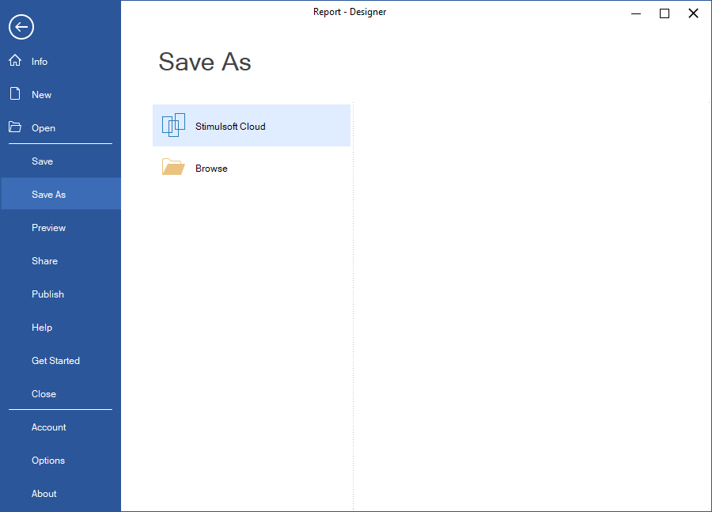

## Save and Save As

The **Save** and **Save** **As** options in the **File** menu allow users to save changes to a report. Selecting Save applies changes to the current report. If the report has not been saved before, the **Save** **As** command will be triggered. **Save As** provides multiple options for saving the report file.

A report can be saved to:

* [Stimulsoft Cloud Storage](https://cloud.stimulsoft.com/);

* Local Storage.

The report can be saved to local storage as:
* Report Template *.mrt (xml);

* Packed Report Template *.mrz;

* Encrypted Report Template *.mrx;

* JSON Report Template *.mrt (json);

* Report Templates with Embedded Data (*mrt). In this case, each data connection is converted into a separate XML file and embedded into the report file as a resource. The data source connections will be redefined to use these embedded resources. This may significantly increase the report file size.

* Compiled Assembly *.dll;

* CSharp Class *.cs.

> **Information**
>
> If you need to save a report as a standalone file (*.exe, *.html), use the [Report Publishing](Publish.md) feature.
