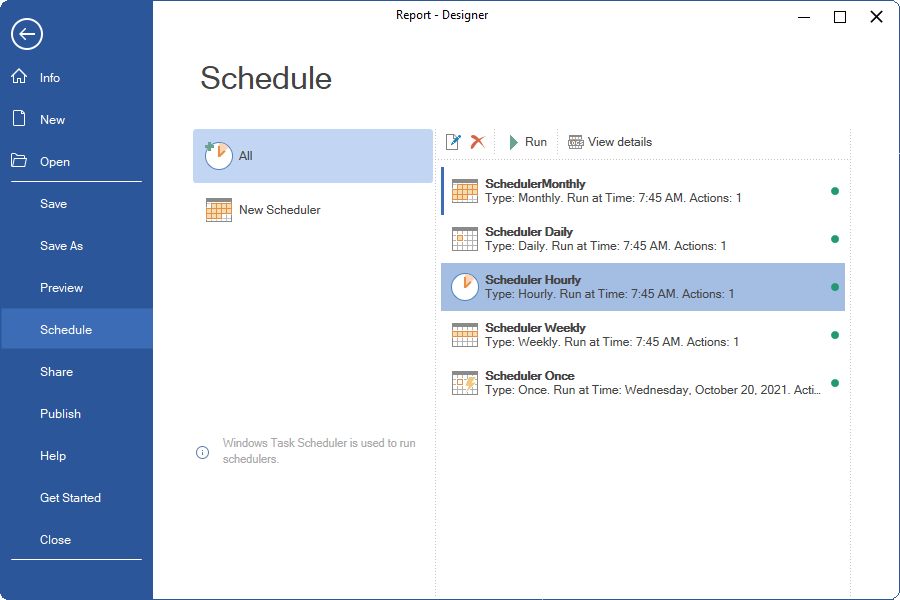
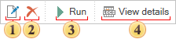
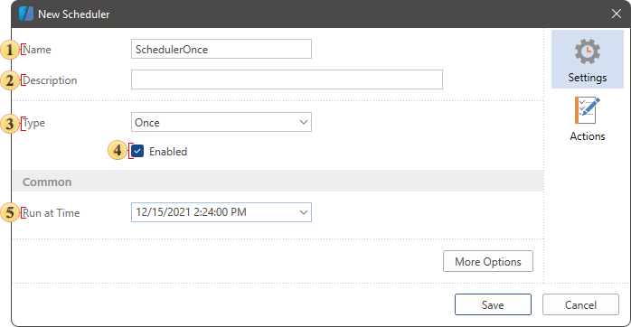
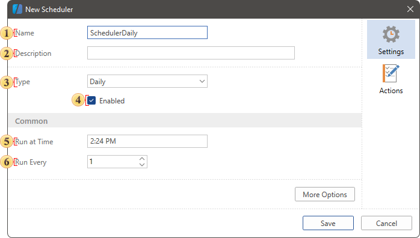
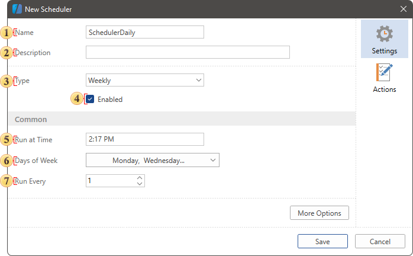
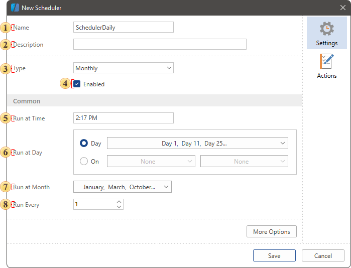
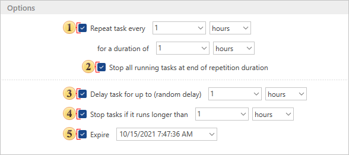
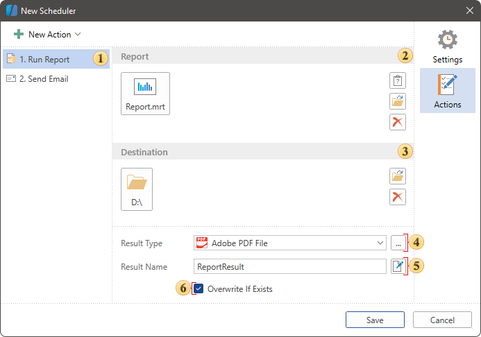
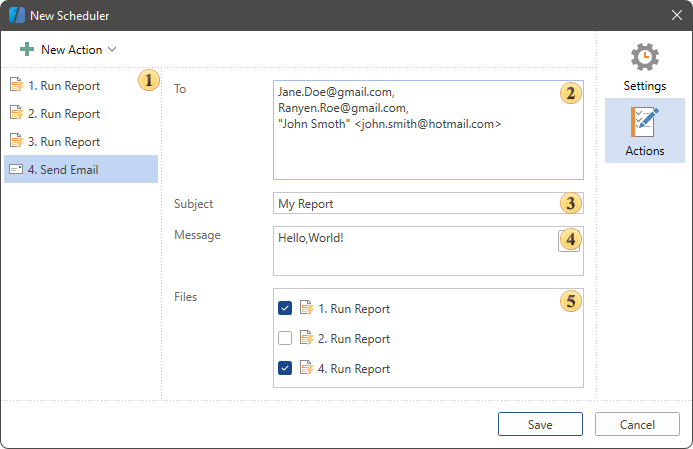

## Schedule

The Schedule point in the File menu contains a list of created Schedulers in the report designer and the command of a new element Scheduler creation. This element allows you to make definite actions with a report by schedule. For example, you can automate the process of report creation, export it to a definite file type and save the result to the local storage or send by email.

The following questions will be considered in this chapter:

* [Panel control of schedulers;](#toolbar)

* [Parameters of the Scheduler Once;](#once)

* [Parameters of the Scheduler Hourly;](#hourly)

* [Parameters of the Scheduler Daily;](#daily)

* [Parameters of the Scheduler Weekly;](#weekly)

* [Parameters of the Scheduler Monthly;](#monthly)

* [More Options;](#moreoptions)

* [Scheduler Actions.](#actions)

All schedulers are located in the Schedule panel point, as a list. To add a new scheduler, you should click the New Scheduler button. When creating a scheduler you should define its type. Depending on a type, schedule settings may vary.
* The Scheduler Once will be run once at a specified date and time, unless otherwise specified by additional parameters;

* The Scheduler Hourly will be run every hour at certain minutes, unless otherwise specified by additional parameters;
* The Scheduler Daily  will be run every day at certain time, unless otherwise specified by additional parameters;
* The Scheduler Weekly will be run on a certain day of the week and time, unless otherwise specified by additional parameters;

* The Scheduler Weekly will be run on a certain day of the week and time, unless otherwise specified by additional parameters.

> **Information**
>
> Any scheduler can be run forcibly. To do that you should select it in the list of schedulers and click the Run button.

Shedulers toolbar

There is the toolbar in the File menu on the scheduler panel where scheduler controls are located.

 The Edit command allows you to call the menu of a selected scheduler editing.

 The Delete command allows you to delete a selected scheduler from the list.

 The Run command allows you to run a selected scheduler forcibly, not having interrupted the schedule.

 The View details command allows you to call the menu of a selected scheduler logos. The event logbook of this scheduler is displayed in the menu of logos. You can save the logs to a file, if needed.

Also, control commands are duplicated in the context menu of the schedulers. Besides, the context menu contains the Delete All command, which allows you to delete all schedulers.

Parameters of the Scheduler once

Below you can see the menu of a new Scheduler Once creation.

 The Name parameter allows you to specify name for the current scheduler.

 The Description parameter allows you to specify an additional explanation for the current scheduler.

 The Type parameter allows you to change a type of the scheduler.

 The Enabled parameter allows you to define the status of the current scheduler: it is run, if the checkbox is checked, or it is stopped, if the checkbox is unchecked.

 The Run at Time allows you to define date and time when the scheduler is run.

Parameter of Scheduler Hourly

Below you can see the menu of a new Scheduler Hourly creation.

 The Name parameter allows you to specify name for the current scheduler.

 The Description parameter allows you to specify an additional explanation for the current scheduler.

 The Type parameter allows you to change a type of the scheduler.

 The Enabled parameter allows you to define the status of the current scheduler: it is run, if the checkbox is checked, or it is stopped, if the checkbox is unchecked.

 The Run at Time allows you to define time when the scheduler is run,  i.e., the minutes of each hour when the scheduler will be run.

 The Run Every parameter allows you to define the interval of the Scheduler Hourly to run. For example, if the parameter is set to 1 value, the scheduler will run every hour. If this parameter is set to 2 value, the scheduler will run every two hours, etc.

Parameters of the Scheduler Daily

Below you can see the menu of a new Scheduler Daily creation.

 The Name parameter allows you to specify name for the current scheduler.

 The Description parameter allows you to specify an additional explanation for the current scheduler.

 The Type parameter allows you to change a type of the scheduler.

 The Enabled parameter allows you to define the status of the current scheduler: it is run, if the checkbox is checked, or it is stopped, if the checkbox is unchecked.

 The Run at Time parameter allows you to define the time of day when the scheduler is run.

 The Run Every parameter allows you to define the interval of the Scheduler Daily to run. For example, if the parameter is set to 1 value, the scheduler will be run every day. If this parameter is set to 2 value, the scheduler will be run every two days, etc.

Parameters of Scheduler Weekly

Below you can see the menu of a new Scheduler Weekly creation.

 The Name parameter allows you to specify name for the current scheduler.

 The Description parameter allows you to specify an additional explanation for the current scheduler.

 The Type parameter allows you to change a type of the scheduler.

 The Enabled parameter allows you to define the status of the current scheduler: it is run, if the checkbox is checked, or it is stopped, if the checkbox is unchecked.

 The Run at Time parameter allows you to define the time of day when the scheduler will be run.

 The Days of Week parameter allows you to select days of the week when the scheduler will be run.

 The Run Every parameter allows you to define the interval of the Scheduler Weekly to run. For example, if the parameter is set to 1 value, the scheduler will be run every week. If this parameter is set to 2 value, the scheduler will be run once two weeks, etc.

Parameters of the Scheduler Monthly

Below you can see the menu of a new Scheduler Monthly creation.

 The Name parameter allows you to specify name for the current scheduler.

 The Description parameter allows you to specify an additional explanation for the current scheduler.

 The Type parameter allows you to change a type of the scheduler.

 The Enabled parameter allows you to define the status of the current scheduler: it is run, if the checkbox is checked, or it is stopped, if the checkbox is unchecked.

 The Run at Time parameter allows you to define the time of day, when the scheduler will be run.

 The Days of Week parameter allows you to select days of the week when the scheduler will be run.

 The Run at Month parameter allows you to select the months when the scheduler will be run.

 The Run Every parameter allows you to define the interval of the Scheduler Monthly to run. For example, if the parameter is set to 1 value, the scheduler will be run every cycle of selected months. If this parameter is set to 2 value, the scheduler will be run once two cycles, etc.

More Options

Apart from basic parameters, each scheduler contains additional parameters, which are located on a separate panel. To open this panel, you should click the More Options button.

 The Repeat task every parameter allows you to define the interval of additional run of the current scheduler. The for a duration of parameter allows you to define the interval during which additional runs of the scheduler will be occurred.

 The Stop all running tasks at the end of repetition duration parameter allows you to stop the scheduler after the completion of the repetition cycle.

 The Delay task for up to parameter allows you to define the delay interval of run the current scheduler.

 The Stop tasks if it runs longer than parameter allows you to define a time interval after which the scheduler will be stopped if its tasks are not completed.

 The Expire parameter allows you to define date and time when the scheduler is stopped.

Scheduler actions

Each scheduler makes definite actions. By type, all actions can be divided into:
* The Run Report, i.e rendering and exporting a report or a dashboard to a definite document;
* The Send Email, i.e sending a report file or a document to a definite list of people.

Max number of actions in the scheduler is limited up to 15 tasks. You can control the Scheduler tasks on the Actions tab in its editor.

 The list of all scheduler actions.

 You should specify a report for the current action in the Report field. Also, if the report contains the parameters, which require user`s request, they can be set using the Parameters special control.

 You should define a local place of saving a finished document in the Destination field.

 The Result Type parameter allows you to define a type of a file, in which a report or a dashboard will be exported. Please take note that the list of available file types differs for a report or a dashboard. If there is a report or a dashboard in a template, the list of file types will be as well as for the template only with a dashboard.

 The Result Name parameter allows you to create a name formation template for the finished document.

 The Owerwrite If Exists parameter allows you to define either the finished document will be overwritten every time when the scheduler is run or a copy of the file will be saved for each exporting.

In case of creating the Send Email action, you should fill some fields, too.

 The list of all scheduler actions.

 The emails of the receivers, who will get a message when the scheduler is run are specified in the To field.

 The theme of the email is specified in the Subject field.

 You can specify the text of your email in the Message field.

 You should choose exported reports using the Run Report actions, which will be attached to the current email. Please take note that you can`t attach other files to the email apart from the result of the Run Report the result of the action.

> **Information**
>
> Please take note that you should define SMPT settings for the Send Email action. These settings are defined in the Options menu of the report designer on the Scheduler tab.
