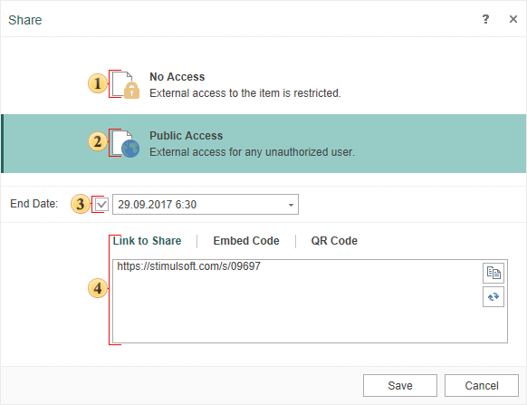

## Share

When designing reports, it often becomes necessary to provide access to it to other users. This can be done in various ways:

* Save a report template or a rendered report, by forwarding these files to other users. However, in this case, Stimulsoft Reports installed will be required to view the reports. In addition, each time you change the report or retrieve new data, you will have to forward these files.

* Export the rendered report to a format like PDF, Excel, HTML, etc. In this case, Stimulsoft Reports installed will not be required, but you will have to generate new documents every time you change the report and forward these files to other users.

* Set up remote access to the report and send the link to users. In this case, Stimulsoft Reports installed will not be required, and you will not have to generate documents every time the report is modified. It will be enough to refresh the page in the browser.

How it works
* The report from the report designer is saved in [Stimulsoft Cloud](https://cloud.stimulsoft.com);
* A link to the report is forwarded to the user. You can also embed the report access code in your HTML page or get a QR code with an access link.
* The user opens the link in the browser, browses the report or downloads it in a format like PDF, Excel, HTML, etc.

To use the remote access, it is necessary to:
* Use the report designer.
* Have access to the Internet, both from the report designer side (to make changes in the report), and from the user side (to download the report from the Cloud).
* Have a Stimulsoft account for the designer of reports. If you do not have an account, you may register it for free.

The remote access can be set up form the Share dialog, which can be called by selecting the Share command from the File menu.

> **Information**
>
> If the report template was opened not from [Stimulsoft Cloud](https://cloud.stimulsoft.com) (when you select the Share command from the File menu), the report must be saved to the account of a user.
>
>
> If you are not logged in, after selecting the Share command from the File menu, the login form will be displayed. If you do not have an account, click the account registration command.

Below is the menu for setting access to the report:

 No Access sets the ability to view only from the report designer or the cloud service, the report cannot be viewed by the link.

 Public Access allows you the remote viewing of the report the link for any user. Also this mode is used when embedding a report to the HTML page.

 This parameter sets the time and date after which access will be denied. If this option is disabled, then there is no validity period, access will always be enabled.

 Access to the report can be provided in the following ways:

* Select Link to Share to get a link only to this item. Also, in this case, the field contains the Copy button (when you click it, the item will be copied to the clipboard), and the Update button (when you click it, a new link to the item will be generated).
* Select Embed Code to get the code for the HTML page with a link to this element. Also in this case, the field contains the Copy button (when you click it, the embed code is copied to the clipboard).
* Select QR Code to display the QR code for reading. When this code is read, the link to the item will be automatically received.

Step-by-step instructions to set up share to a report

Step 1: Run the report designer;

Step 2: Create or open a report to which you want to configure share.

Step 3: Select Share in the File menu.

Step 4: If the report was not opened from [Stimulsoft Cloud](https://cloud.stimulsoft.com), specify the storage location in the workspace of your account and click the Save button in the Save As... dialog;

Step 5: Set the Public Access in the Share menu.

Step 6: Enable the End date parameter, and specify the time which is the date when the public access to the report is terminated;

Step 7: Select the type of file in which the report will be submitted. Please note that viewing a report without downloading is possible only if the Document file type is selected. If you select a different type, for example PDF, then when you click on the link, you will download the PDF file for local viewing.

Step 8: Copy the share link to the report;

Step 9: Click the Ok button in the Share menu;

Step 10: Forward the link to the user.

When clicking on the link, the web browser will run. The report will be displayed in the web browser or if a different result type is selected, the report will be downloaded using the browser.

> **Information**
>
> The report can be viewed by the link only if the Result Type is set as the Document file. In other cases, the report will be downloaded using the web browser.
>
>
> However, when viewing the report, you can always download it in the required format without changing the access settings and without sending a new link. Add /Result Type to the link.
>
>
> For example, if the link for viewing the report is [https://stimulsoft.com/s/55af6](https://stimulsoft.com/s/55af6) , and this report should be downloaded as a PDF document, then, in the address bar, add /pdf. So the link will look like [https://stimulsoft.com/s/55af6/pdf](https://stimulsoft.com/s/55af6/pdf).
