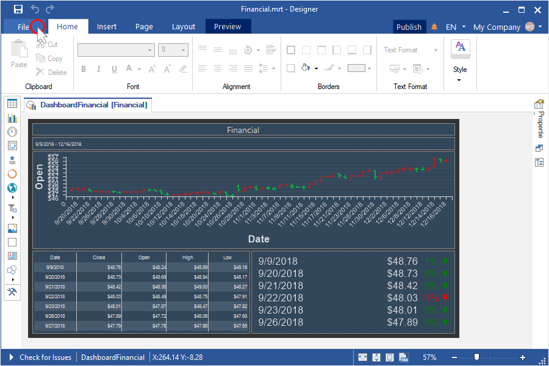

## File menu

The main element is the **File menu** and the menu that is called by pressing **File** button. This is a main menu of the report designer. Basic commands for work with reports in the report designer are represented in the menu. The picture below shows a menu of the application and its items.

* The [Info](Info.md) menu item contains report options, protect report and check for issues commands.

* The [New](New.md) menu item contains submenu where a list of new report components is available for creation is shown.

* The [Open](Open.md) menu item. When calling this menu item, a dialog for opening a report will appear.

* The [Save](Save.md) menu item saves changes in a report. If a report was not changed previously, then the Save Report As menu item will be called automatically.

* The [Save As](Save.md) menu item. When calling this menu item, a dialog for saving a report will appear.

* The [Preview](Preview.md) menu item. When calling this menu item, a report will be shown in the viewer.

* The [Scheduler](Scheduler.md) menu item contains create or set scheduler commands.

* The [Share](Share.md) menu item. When calling this menu item, a dialog for sharing a report will appear.

* The [Publish](Publish.md) menu item. When calling this menu item, a dialog for publishing a report will appear.

* The [Help](Help.md) menu item contains helper resources.

* The [Get Started](Get_Started.md) menu item. When calling this menu item, a menu for getting Stimulsoft Products will appear.

* The [Account](Account.md) menu item contains submenu where you can control your team, subscriptions and account settings.

* The [Options](Options.md) menu item calls a window for designer parameters settings.

* The [Close](Close.md) menu item closes a report that is opened in the report designer.

* The [About](About.md) menu item. When calling this menu item, a menu for showing product information will appear.
