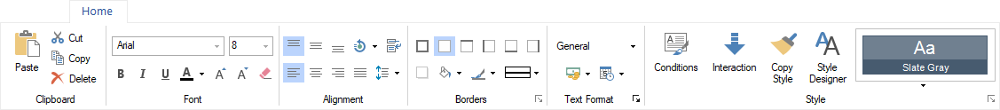
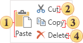
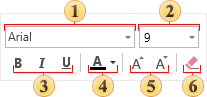
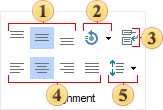
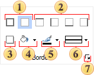
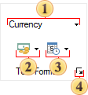
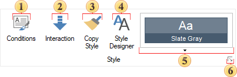

## Tab Home

The **Home** tab is a section of the Ribbon in the report designer, containing key commands for configuring report components and dashboard elements.

**Clipboard Management Commands**

This group includes commands for working with the clipboard:

 The **Paste** command allows inserting components or elements from the clipboard into the report page or dashboard.

 The **Cut** command allows cutting selected components or elements to the clipboard.

 The **Copy** command allows copying selected components or elements to the clipboard.

 The **Delete** command allows deleting all selected components or elements.

**Font Group**
This group contains commands and controls for managing the [font](../Report_Internals/Appearance/Fonts_and_Font_Brushes.md) settings of report components or dashboard elements:

 A control that allows changing the font family. Clicking this control opens a drop-down list of installed fonts.

 A control that allows changing the font size. Clicking this control opens a drop-down list of predefined font sizes. Font size can also be entered manually.

 Controls that enable or disable bold, italic, or underlined text styles.

 A controls that allows changing the text color of the selected component or element.

 Controls that adjust the font size up or down.

 The **Clear Contents** command removes the content of all selected text components.

**Alignment Group**

This group contains commands for managing horizontal and vertical alignment, text rotation, word wrapping, and line spacing:

 The [Vertical Alignment](../Report_Internals/Appearance/Vertical_Alignment.md) controls: **Top**, **Center**, **Bottom**.

 The Text Rotation control opens a drop-down list for selecting the text rotation angle.

 The **WordWrap** button enables word wrapping in text components. When enabled, text automatically moves to the next line when reaching the right boundary of the component. If disabled, text is truncated at the component’s edge.

 The [Horizontal Alignment](../Report_Internals/Appearance/Horizontal_Alignment.md) controls: **Left**, **Center**, **Right**, **Width**.

 The [Line Spacing](../Report_Internals/Appearance/Horizontal_Alignment.md#LineSpacing) controls open a drop-down menu for selecting text line spacing options.

**Borders Group**

This group contains commands and controls for configuring the [borders](../Report_Internals/Appearance/Borders.md) and background settings of report components and dashboard elements.

 Controls that enable or disable the display of all borders for a component or element.

 Controls that enable or disable the display of borders for each side of a component or element.

 A control that enables or disables the shadow effect for a component or element.

 A control that allows changing the background fill color of a component or element. Clicking this control opens a color palette.

 A control that allows changing the border color of a component or element. Clicking this control opens a color palette.

 A control that allows changing the border style of a component or element. Clicking this control opens a drop-down list of available border styles.

 A command that opens the [border editor](../Report_Internals/Appearance/Borders.md#BorderEditor).

**Formatting Group**

This group contains commands and controls for [text formatting](../Report_Internals/Text_Formatting/index.md).

 A control that allows changing the text format. Clicking this control opens a drop-down menu with a list of available formats.

 A control that allows changing the currency for text formatted as currency. Clicking this control opens a drop-down menu with the most commonly used currencies.

 A control that allows changing the [date format](../Report_Internals/Text_Formatting/Date_Formatting.md) mask. Clicking this control opens a drop-down menu with a list of available date format masks.

 A command that opens [Format editor](../Report_Internals/Text_Formatting/index.md).

**Styles Group**

This group contains commands for managing [styles](../Report_Internals/Appearance/Styles/index.md) and [conditions](../Report_Internals/Conditional_Formatting/index.md) for report components and dashboard elements.

 A command that opens [condition editor for components](../Report_Internals/Conditional_Formatting/index.md).

 A command that opens the interaction editor for  [report components](../Report_Internals/Interaction/index.md) and [dashboard elements](../Dashboards/Interaction.md).

 A button that copies the formatting of the selected component or element. When activated, the formatting settings of the selected component are stored in the clipboard. These settings can then be applied to other report components of the same type. To clear the copied formatting from the clipboard, click this button again to disable the formatting copy mode.

 A command that opens [style designer](../Report_Internals/Appearance/Styles/Style_Designer.md).

 A control that allows selecting a style for report components or dashboard elements. Clicking this control opens a drop-down list of styles and collections. When a collection is selected, it is [applied to the report](../Report_Internals/Appearance/Styles/Style_Collections.md#ApplyStyleCollection).

 A command that opens [style designer](../Report_Internals/Appearance/Styles/Style_Designer.md).
