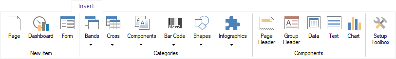
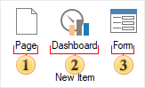
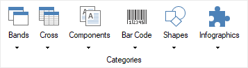
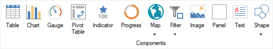
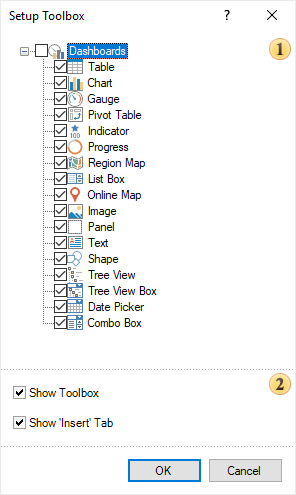
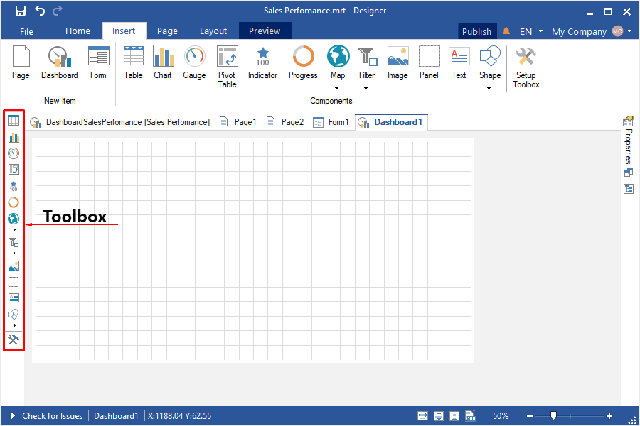

## Tab Insert

The Insert tab is a section of the Ribbon in the report designer that contains commands for creating a new page, a new form, a new dashboard, as well as inserting report components or dashboard elements. It functions as an equivalent to the [Toolbox](#Toolbox) in the report designer and can be used alongside it or independently.

You can enable or disable the Insert tab in:
* [Report Designer settings](File_Menu/Options.md);
* [Toolbox settings](#SetupToolbox).

All elements in the Insert tab or Toolbox are organized into groups.

New Item Group

This group contains commands for creating primary elements within the current report template. It is only available on the Insert tab.

 A command that creates new report page the template.

 A command that creates [dashboard](../Dashboards/index.md) to the template.

 A command that creates a new dialog form to the template.

> **Information**
>
> By default, the create new dialog form command is disabled. To make it visible on the Insert tab, enable the Show Dialog Forms option in the [report designer settings](File_Menu/Options.md).

Categories Group

This group contains report component categories. It is not available for dialog forms or dashboards.

Components Group

This group contains report components, dashboard elements, or dialog form components, depending on the main element in the current report template. The list of available elements in this category can be configured in the Toolbox settings when designing reports or dashboards.

Toolbox Settings

In the Toolbox settings, you can define the list of elements that will be displayed in the Components group on the Insert tab and in the Toolbox. Enable or disable the visibility of the Insert tab and the Toolbox in the report designer. To access the Toolbox settings, click the Setup Toolbox button on the Insert tab or directly in the Toolbox.

 A component list determines which report components or dashboard elements appear in the Components group on the Insert tab and in the Toolbox. If an item is checked, it will be displayed; if unchecked, it will not appear.

 A options, that enable or disable Toolbox and Insert Tab controls the visibility of the Insert tab and Toolbox in the report designer. If checked, they will be displayed; if unchecked, they will be hidden.

> **Information**
>
> Either the Insert tab or the Toolbox must always be visible in the report designer. It isn't possible to disable both at the same time.

Toolbox

The Toolbox is a sidebar in the report designer that contains report components, dialog form components, and dashboard elements. It functions as an equivalent to the Insert tab.

You can enable or disable the Toolbox in:
* [Report designer settings](File_Menu/Options.md);

* [Toolbox settings](#SetupToolbox);

* [Page](Page_Tab.md) tab of the report designer.
