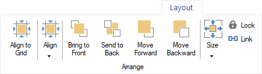
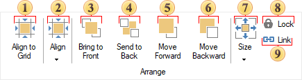
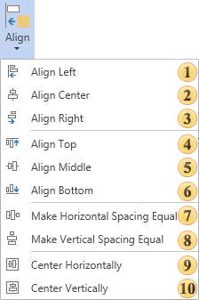

## Tab Layout

The Layout tab is a section of the Ribbon in the report designer that contains commands for managing the placement of components on the page and elements on the dashboard.

Placement Group

The group contains a lot of commands to change position of components on a page. The picture below shows this group.

 The Align to Grid command that aligns all selected components to the page or dashboard grid.

 Controls that provides various alignment options for selected components and elements. Clicking this control opens a drop-down menu with alignment commands. A detailed  [description of these commands](#Align) is provided below.

 The Bring to Front command that moves the selected components or elements to the front, placing them at the highest level in the component or element hierarchy. The hierarchy can be viewed in the [Tree](Panels.md#Tree) panel.

 The Send to Back command that moves the selected components or elements to the back, placing them at the lowest level in the hierarchy. The hierarchy can be viewed in the [Tree](Panels.md#Tree) panel.

 The Move Forward command that moves the selected components or elements one level up in the hierarchy. The hierarchy can be viewed in the  [Tree](Panels.md#Tree) panel.

 The Move Backward command that moves the selected components or elements one level down in the hierarchy. The hierarchy can be viewed in the [Tree](Panels.md#Tree) panel.

 Controls that allows selecting predefined sizes for the selected components. Clicking this control opens a drop-down menu with size commands. A detailed [description of these commands](#Size) is provided below.

 The Lock command, that enables or disables the ability to resize, move, or edit a component. If this command is active (button pressed), modifications to the selected component or element are restricted. If inactive (button not pressed), the component or element can be freely edited.

 The Link command, that associates selected components or elements with containers. When active (button pressed), the selected component or element becomes a dependent element of the container, regardless of its position. The container in this case is another report component or dashboard element. If inactive (button not pressed), the component or element remains dependent on the container it is placed on during report generation.

Alignment Menu

This menu contains commands for aligning selected components or elements.

 Align all selected components to their common left margin.

 Align horizontally all selected components to their common center.

 Align all selected components to their common right margin.

 Align all selected components to their common top margin.

 Align vertically all selected components to their common center.

 Align all selected components to their common bottom margin.

 Make horizontal spacing of selected components equal by their width.

 Make vertical spacing of selected components equal by their height.

 Center all selected components horizontally.

 Center all selected components vertically.

Size Menu

This menu contains commands for setting the sizes of the selected report components or dashboard elements. The original sizes, i.e., the sizes that will be applied to other components or elements, are the sizes of the component or element from which the selection of the group of components or elements was initiated.

 Make the same size of components as the size of the first selected component.

 Make the same width of components as the size of the first selected component.

 Make the same height of components as the size of the first selected component.
