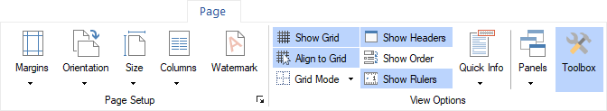
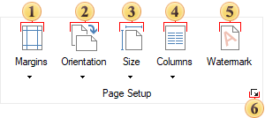
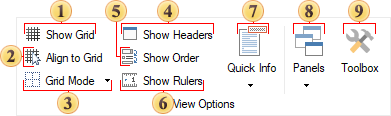

## Tab Page

The **Page** tab is a tab on the Ribbon of the report designer that contains commands for managing the report page settings, the workspace of the dashboard panel, and the dialog form.

**Page Settings Group**

This group contains elements to control basic parameters of a page. These are page margins, orientation, page size, columns.

 A control that allows selecting page borders. When clicked, a dropdown menu appears where page borders can be selected.

 A control for changing the page orientation. When clicked, a dropdown menu appears where the page orientation can be selected.

 A control for changing the page size. When clicked, a dropdown menu appears with a list of available page sizes.

 A control for selecting the number of columns on the report page. When clicked, a dropdown menu appears with the available column count options.

 A command to open the **Page Setup** window and navigate to the **Watermark** tab. [Learn more about adding a watermark in the report](../Report_Internals/Watermarks/index.md).

 A command to open the **Page** Setup window and navigate to the **Paper** tab.

**View Options Group**

This group contains settings for displaying the grid, additional information, and commands for enabling various panels.

 The **Show Grid** command enables or disables the grid display on the report template page or in the dashboard panel workspace.

 The **Align to Grid** command allows aligning selected components or elements to the grid nodes.

 A control for selecting the grid drawing mode: **Lines** or **Dots**.

 The **Show Headers** command enables or disables the display of component headers in the report template.

 The **Show Order** command enables or disables the display of the component or element order number. The order number is assigned as components are added to the report or elements to the dashboard panel.

 The **Show Rulers** command enables or disables the display of rulers in the report designer.

 A control that allows displaying additional information on report components or dashboard elements. This is an equivalent of the  [Quick Info](File_Menu/Options.md#QuickInfo) tab in the report designer settings.

 A control that allows enabling or disabling the display of various report designer panels, such as [Properties](Panels.md#PropertiesGrid), [Dictionary](Panels.md#Dictionary), [Tree](Panels.md#Tree).

 The **Show Toolbox** command enables or disables the display of the  [Toolbox](Insert_Tab.md#Toolbox).
