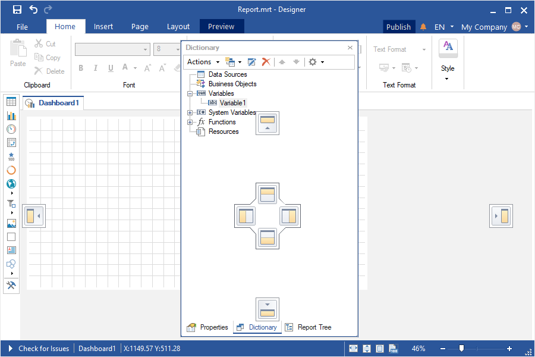
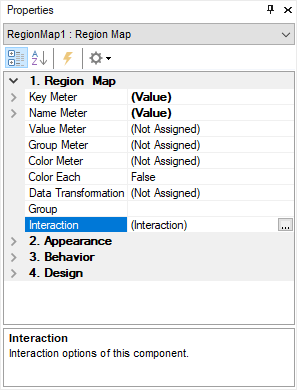
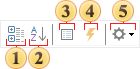
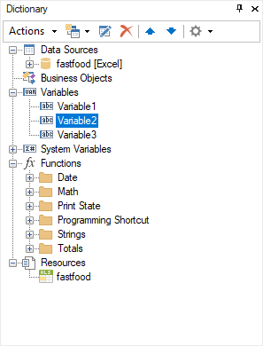
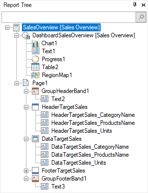

## Panels

| Attention |
| --- |
| Scripts can pose a security risk. Therefore, [colculation mode](Template/Calculation_Mode.md) are disabled in Interpretation mode. If you are confident in the security of the scripts, you can use them in Compilation mode. |

In addition to the Ribbon and Toolbox, the report designer includes the following panels:

* [Properties](#PropertiesGrid) - a panel displaying the properties of the selected element, their values, and associated events.

* [Dictionary](#Dictionary) - a panel that displays all created data sources, variables, functions, and resources.

* [Tree](#Tree) - a panel that shows the hierarchy of report components or dashboard elements.

You can enable or disable these panels in the Page tab under the [Panels control menu](Page_Tab.md#Panels). These panels can also be moved within the designer window. To do this:
* Hover the mouse cursor over the panel title;

* Press and hold the left mouse button and move the cursor without releasing it.

When moving panels, a docking guide appears to help snap the panel to other interface elements. However, free movement of panels is also possible.

Properties Grid

The Properties grid displays the properties of the selected report component or dashboard element, as well as component events. The panel includes:

* A control that allows changing the selected component or element. When clicked, a list of all report components or dashboard elements is displayed;
* A toolbar for managing the properties grid;
* A table displaying the properties or events of a component or element;
* A description field for the selected property.

ToolBar

This panel contains commands for managing the Properties panel.

 The Categorized command groups the properties of a component or element into categories.

 The Alphabetical command sorts the list of component or element properties alphabetically, from A to Z.

 The command to switch to the Properties Tab of the selected component or element.

 The command to switch to the Events Tab of the selected component.

 A control containing commands for configuring the Properties panel:

  * The Localize Property Grid command enables or disables localization of property names. If enabled (checkbox checked), property names will be translated when the designer's interface language changes. If disabled (checkbox unchecked), property names will not be localized;

* The Show Description command enables or disables localization of property names. If enabled (checkbox checked), property names will be translated when the designer's interface language changes. If disabled (checkbox unchecked), property names will not be localized;
* Commands for selecting the property table type: Basic, Standard, Professional. Depending on the selected type, the list of properties of the component or element will be minimal, standard or extended.

Dictionary

This panel in the report designer displays created [data sources](../Data/Data_Dictionary/DataSources/index.md), [functions](../Report_Internals/Functions/index.md), [variables](../Data/Data_Dictionary/Variables/index.md), business objects, [resources](../Data/Dictionary/Resources.md).

More details about the Dictionary, working with it and its elements [can be found in the corresponding section](../Data/index.md).

Report Tree

The Report Tree panel displays the hierarchy of report components or dashboard elements. The hierarchy of report components displays the order in which they are processed when building a report, i.e. the higher the component is in the hierarchy, the earlier it will be processed.

To change the processing order of a component or element, select it and use the controls in the [Layout](Layout_Tab.md) tab of the report designer to move it within the hierarchy.

> **Information**
>
> The Tree panel also includes a search field to find components or elements by name. Additionally, if a report component has an associated event, it will be marked with an event icon in the hierarchy.
