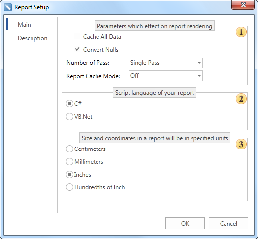
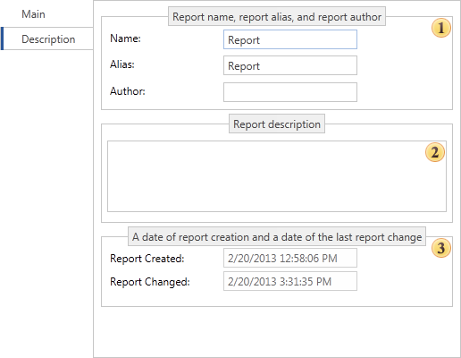

## Dialog Report Setup

If to select the **Options** item in the submenu of the **Report** group, then the **Report Setup** window is invoked that allows you to identify the basic information and report parameters. The picture below shows the **Report Setup** dialog:

As can be seen from the picture above, the editor of the report parameters contains two tabs: **Main** and **Description**. The **Main** tab is represented by three groups, which define the most important parameters of the report:

 In this group, basic parameters that affect the designing of the report are defined.

 This group defines a scripting language of a report. You may switch between C# and VB.NET.

 In this group you may select units of the report.

The **Description** tab defines information of report parameters. The picture below shows the **Description** tab:

As can be seen from the picture above, the **Description** tab is represented by three groups:

 A group of names. In this group the **Name**) and **Alias** of a report are specified, as well as the **Author's** name of the report.

 A group of the report description. In this group the report description is defined.

 This group is not available for editing and displays temporary information: when the report was created **(Report Created)** and the date of last modification of the report **Report Changed**.
