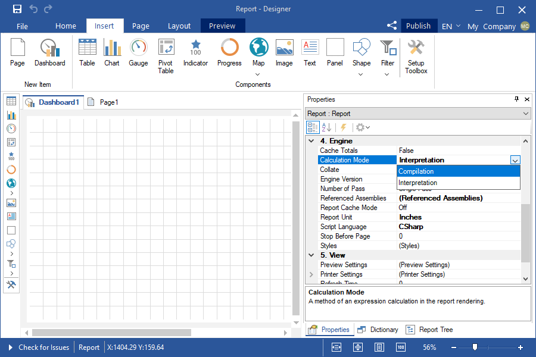
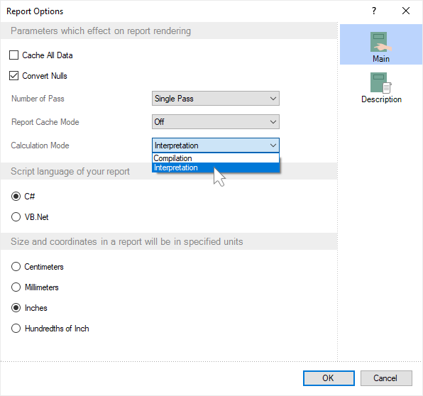

## Calculation mode

Important

Scripts can be a security risk, so they are disabled in the [Interpretation mode](). However, if you are confident in the safety of your scripts, you can use them in the [Compilation mode]().

When you design reports and dashboards, expressions can be processed in the Interpretation or Compilation mode.

In the Compilation mode, the CSharp compiler is used to calculate expressions. In this case, it is allowed to use events, various methods, and functions of the .NET Framework. However, the time taken to build a report or dashboard is slowing down, and it also requires more RAM.

In Interpretation mode, the Stimulsoft interpreter is used to calculate expressions. This speeds up the building of a report or dashboard and reduces the required amount of RAM. However, only built-in functions and methods can be used in a report or dashboard. The use of events and third-party scripts is not allowed.

> **Information**
>
> For some platforms, report generators cannot use the Compilation mode. For example, on the .NET Core and JavaScript platforms, all expressions in reports and on dashboards are processed only in the Interpretation mode.

You can change the mode of calculating expressions in a report or on the dashboard in the following way:

* In the report designer, select the report template area and choose the expression processing mode as the value of the Calculation Mode property on the Property panel.

* Double-click on the report template area to call the Report Options window. Select the expression processing mode as the value of the Calculation mode parameter.

> **Information**
>
> You should know that you can only edit the dashboard from the viewer if the expression processing mode is set to Interpretation.
