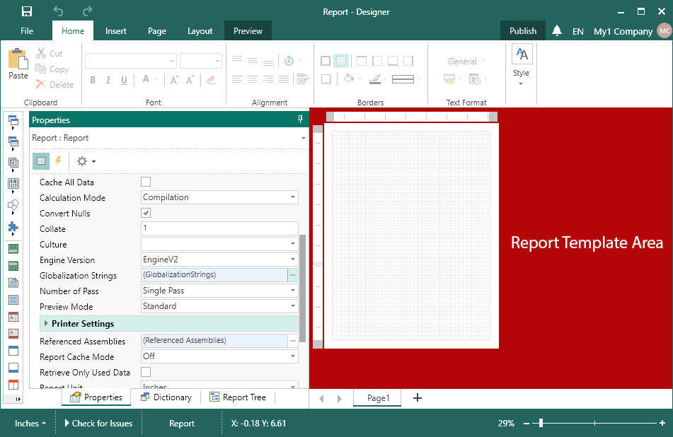
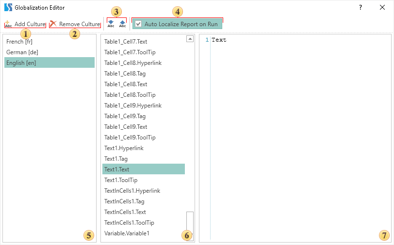

## Globalization Editor

When designing reports, there can be situations when users who view rendered reports have different language cultures. In this case, they can make the required number of copies of the report, each of which is localized in a specific language. However, when editing one report template, you will have to do changes in all of its copies. Thus, every change in the report template will increase the time spent on preparing the report and significantly increases the likelihood of errors in copies of this report.

Our report generator provides the ability to localize the report depending on the selected report culture. The **Globalization Strings** tool is used for this. You can define a list of cultures with which the elements of the report will be translated. The items for which you can configure localization include:

* Report properties: Report Alias, Report Author, Report Description;

* Text component, text in cells, Rich text;

* Each cell of the Table and the Cross-tab components;

* Variables in the report;

* The text fields of the Chart component (labels, legends, rows, charts, and also you can override the values of the text properties before and the text after these chart items).

You should know that for each text component, as well as for each cell in the **Table** and **Cross-tab**, you can override several properties of this component. For example, if the report uses the text component **Text1**, then:

* In the **Text1.Hyperlink** property, you can specify a hyperlink (or expression) when you select a specific culture. For example, you can specify a hyperlink (or expression) on a localized page of your website.

* In the **Text1.Tag** property, you can specify a tag (or expression) for this text component when you select a specific culture. The tags in the report are used to refer to a particular report component.

* In the **Text1.Text** property, you can specify the text (or expression) of the text component that will be processed when the report is rendered and displayed to the user when a particular culture is selected.

* In the **Text1.Tooltip** property, you can specify the tooltip (or expression) of this text component when you select a specific culture.

If a property is not filled, then when you select a specific culture, the result will be empty. For example, if you do not specify anything for a particular culture in the **Text1**. Text property, then when you select this culture, the text component will be printed without any content.

> **Infomation**
>
> The report culture does not depend on the localized GUI of the report designer. The culture of the report depends on the value of the Culture property. The list of values for this property depends on the list of cultures supported by the operating system. By default, the report uses the current culture of the operating system.

To call the Globalization Editor, you should go to the report properties and click in the report template area.

And on the properties panel, click the Browse button on the Globalization property. Below is the view of the Globalization Editor.

 Click this button to add a new culture. The added cultures will be displayed in the list of cultures.

 Select the culture in the list and click this button to remove the culture from the list.

 The buttons to control cultures.

* Get the culture settings from the report, in this case, for the items of the selected culture, the values that are used in the report will be specified.

* Transfer culture settings to a report, in this case, the values from the selected culture will be specified for the report items.

 If the Auto Localize Report on Run option is enabled, then, when rendering reports, the report engine will check the report culture and whether they are presented in the list. If identical cultures are found, then expressions of the report items will be replaced.

 The list of cultures, setting which, the localization of the report items will occur (i.e. replacing expressions that are specified in a particular culture).

 The list of report items, which localization can be configured.

 An expression of the item that will be assigned to the selected report item when you select a specific culture.

To automatically localize the report, you should specify the report culture after specifying the list of cultures and their settings. To do this, select the required value in the Culture property of the report. Then, when rendering the report, the report engine will check the report culture and their presence in the list of cultures. If identical cultures are found, the expressions of the report items will be replaced.
