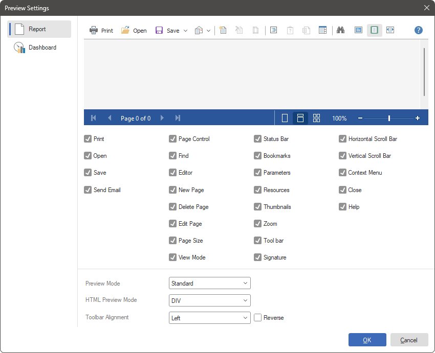
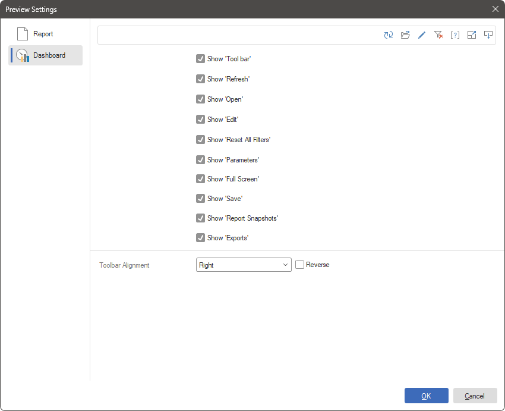

## Preview settings

When designing a report and dashboard, or before exporting, printing, sending by email, you can preview them. Viewing a report or dashboard is done on a separate tab in the report designer. The preview tab for reports and dashboards contains toolbars with buttons and menus.

In the report designer, you can customize toolbars to preview a report or dashboard. You can do this in the Preview Settings editor. To call this editor, you should do the following:

* Left-click in the report template area (outside the page and dashboard).

* Click the Browse button of the Preview Settings property.

* Since reports and dashboards use different viewing modes, their toolbars differ. On the [Report tab](#report) of the editor, the toolbar is configured when viewing the current report, and on the [Dashboard tab](#dashboard), the current toolbar is configured.

> **Information**
>
> Pay attention to these settings are stored in the template itself and are applied to the viewer toolbar only when viewing the current report or dashboard.

Report preview settings
In the preview editor, on the Report tab, you can find a panel with a preview and a panel of parameters on which you can disable the buttons and controls in the preview. To disable a button or any control, you should uncheck a particular setting. Accordingly, to enable a button or control, a flag must be checked for that parameter. The included buttons and controls in the preview panel are displayed in real-time.

Below is a table of parameters for customizing the report viewer toolbar.

Parameter

Description

Print

This parameter is used to enable/disable the display of the Print button on the toolbar.

Open

This parameter is used to enable/disable the display of the Open button on the toolbar.

Save

This parameter is used to enable/disable the display of the Save button on the toolbar.

Send Email

This parameter is used to enable/disable the display of the Send Email button on the toolbar.

Page Control

This parameter is used to enable/disable the display of the page navigation control in the status bar.

Find

This parameter is used to enable/disable the display of the Find button on the toolbar.

Editor

This parameter is used to enable/disable the display of the Editor button on the toolbar.

New Page

This parameter is used to enable/disable the display of the New Page button on the toolbar.

Delete Page

This parameter is used to enable/disable the display of the Delete Page button on the toolbar.

Edit Page

This parameter is used to enable/disable the display of the Edit Page button on the toolbar.

Page Size

This parameter is used to enable/disable the display of the Page Size button on the toolbar.

View Mode

This parameter is used to enable/disable the display of the View Mode buttons on the toolbar.

Status bar

This parameter is used to enable/disable the display of the status bar in the viewer.

Bookmarks

This parameter is used to enable/disable the display of the Bookmarks button on the toolbar.

Parameters

This parameter is used to enable/disable the display of the Parameters button on the toolbar.

Resources

This parameter is used to enable/disable the display of the Resources button on the toolbar.

Thumbnails

This parameter is used to enable/disable the display of the Thumbnails button on the toolbar.

Zoom

This parameter is used to enable/disable the display of the zoom control in the status bar.

Toolbar

This parameter is used to enable/disable the display of the toolbar in the viewer.

Signature

This parameter is used to enable/disable the display of the Sign button on the toolbar.

Horizontal Scroll bar

This parameter is used to enable/disable of the horizontal scroll control in the viewer.

Vertical Scroll bar

This parameter is used to enable/disable of the vertical scroll control in the viewer.

Context Menu

This parameter is used to enable/disable the display of the context menu in the viewer.

Close

This parameter is used to enable/disable the display of the Close button on the toolbar.

Help

This parameter is used to enable/disable the display of the Help button on the toolbar.

Preview Mode

This parameter is used to define mode of the report view in the viewer Standard, Dot-matrix or Standard and Dot-matrix.

HTML Preview Mode

This parameter is used to define mode of the report layout for viewing in the Web viewer: DIV or Table.

Toolbar Alignment

This parameter is used to define mode of the viewer toolbar alignment: Left, Center, Right.

Reverse

This parameter is used to define order of the the viewer controls in direct order, i.e. from left to right or reverse order, i.e. from right to left.

Setting the dashboard preview
In the preview editor, on the Dashboard tab, a toolbar and a parameter panel are presented, on which you can disable the buttons on the toolbar. To disable the button, you should uncheck the box for a particular parameter. Accordingly, to enable the button, you must check it for any setting. The enabled buttons on the toolbar are displayed in real-time.

Below is a table of parameters for customizing the dashboard viewer toolbar.

Parameter

Description

Show 'Too bar'

This parameter is used to enable/disable the display of the toolbar in the viewer.

Show 'Refresh'

This parameter is used to enable/disable the display of the Refresh button on the toolbar.

Show 'Open'

This parameter is used to enable/disable the display of the Open button on the toolbar.

Show 'Edit'

This parameter is used to enable/disable the display of the Edit button on the toolbar.

Show 'Reset All Filters'

This parameter is used to enable/disable the display of the Reset All Filters button on the toolbar.

Show 'Parameters'

This parameter is used to enable/disable the display of the Parameters button on the toolbar.

Show 'Full Screen'

This parameter is used to enable/disable the display of the Full Screen button on the toolbar.

Show 'Save'

This parameter is used to enable/disable the display of the Save button on the toolbar.

Show 'Report Snapshot'

This parameter is used to enable/disable the display of the Report Snapshot command on the Save menu.  This command is only available if the calculation mode property sets as Interpretation.

Show 'Exports'

This parameter is used to enable/disable the display of the export commands on the Save menu

Toolbar Alignment

This parameter is used to define mode of the viewer toolbar alignment: Left, Center, Right.

Reverse

This parameter is used to define order of the the viewer controls in direct order, i.e. from left to right or reverse order, i.e. from right to left.

 This option is used to enable/disable the display of the toolbar in the preview tab.

 This option is used to enable/disable the display of the Refresh button on the toolbar.

 This option is used to enable/disable the display of the Open button on the toolbar.

 This option is used to enable/disable the display of the Edit button on the toolbar.

 This option is used to enable/disable the display of the Full Screen button on the toolbar.

 This option is used to enable/disable the display of the Menu button on the toolbar.

  This option is used to enable/disable the display of the Report Snapshot command in the Menu on the toolbar.

 This option is used to enable/disable the display of export commands in the Menu on the toolbar.

> **Information**
>
> You should know that you can enable or disable the display of buttons on the dashboard elements in the viewer or on the preview tab. Select the element in the report designer, click the Interaction button on the Home tab of the Ribbon panel, and [check/uncheck the box for the parameters](../../Dashboards/Interaction.md#InteractionEditor) if you want to display/hide the buttons of elements.
