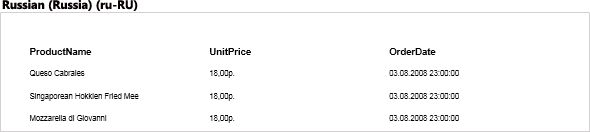
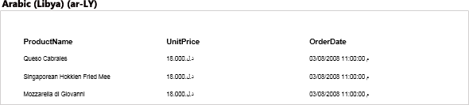
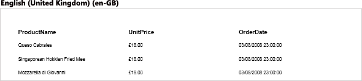
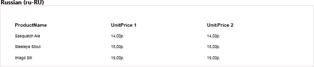
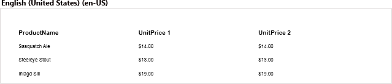
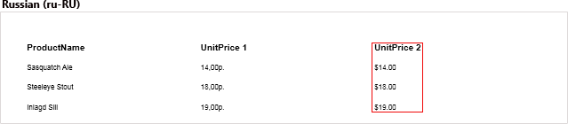

## Report Culture

By default, the regional settings of the operating system are used to build reports and dashboards. If you need to show data in the report or dashboard, regardless of the current culture in the operating system, then you should apply a particular culture to this report or dashboard. To apply culture to a report or dashboard, use the **Culture** property of the report template. Set the culture code (format **xx-XX**, for example, **en-GB**) in the field of the property. After that, the report generator, before rendering a report, will set a specific culture and apply regional settings for components and elements. Below, you may find an example of the report with different cultures:

You should notice that the first columns contain text that is independent of the report culture. The second (currency) and third (date-time) columns are culture-dependent. Therefore, when changing the culture, the type of data record changes.

**Information**

It is impossible to remember all the codes of cultures. Therefore, for convenience, you can find the list of values of the **Culture** property in a drop-down menu with a list of cultures and their codes that are available in the operating system on the current computer.

If you need the components to be independent of culture, displayed the same for any culture applied to the report, you should uncheck the **Use local settings** parameter and define formatting settings in the [Text Format](../../Report_Internals/Text_Formatting/index.md) editor of the text component. For example, you want to see the price of a product always in the same currency, regardless of regional settings. Below is a report sample with different cultures:

As you can see in the picture, the currency depends on the culture applied to the report, which is not entirely true. In order for the price to always be in the same currency, you should select the text component in the report template with reference to the **UnitPrice 2** column and the [Currency format](../../Report_Internals/Text_Formatting/Currency_Formatting.md) editor to determine specific parameters – currency, USD. Now, regardless of the report culture, the price in this column will always be in the USD:

As you can see, when applying the Russian (ru-RU) culture, the currency in the second column has not changed, while in the first one, it depends on the culture used.

**Information**

If the culture selected for the report is not supported by the operating system, then the current culture of the operating system will be applied to the report.
