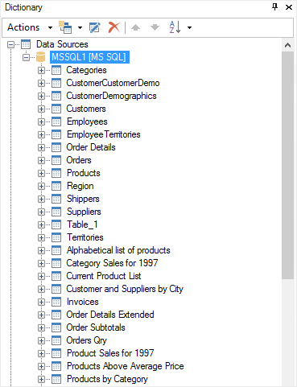
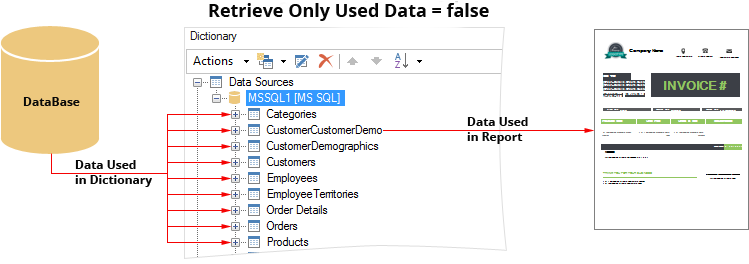
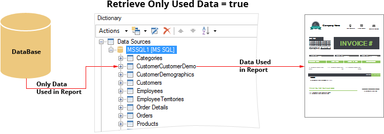

## Retrieve Only Used Data

Sometimes it is enough to change the value of one property to significantly increase the speed the report rendering. When working with the report template, the data dictionary does not contain any real data. Data in the dictionary are located only as a description of the data structure. Execution of all queries and data transfer from the storage is carried out at the moment of the report rendering process. At this time, the entire structure of the dictionary is filled with real data. In other words, if 200 data sources are created in the dictionary then the actual data are transferred from the storage to all those sources. The more data to be transmitted from the storage to the dictionary, the longer is the time of the report rendering process. However, not always all data sources are used in the report. To significantly reduce the time of the report rendering getting only real data for data sources used in the report, you should set the Retrieve Only Used Data report property to true.

Consider an example. For example, a MS SQL database that contains data tables, stored procedures, and views is used. The picture below shows the data structure of the dictionary:

Each table contains data from one to the plurality of data columns, with at least one data row. For example, only the CustomerCustomerDemo data source will be used in the report.

* The Retrieve Only Used Data property is set to false

In this case, when rendering the report, data will be transferred from the database for each table in the data dictionary, and then the dictionary in the report itself. In other words, every table will be filled with actual data. Then, the report generator, selects the data used in the report and displays them in a structured way. Time of the report rendering depends on how fast data is transferred and the data size. The faster the data will be transmitted, the faster the report will be rendered. The picture below schematically shows the data transferring, if the Retrieve Only Used Data property is set to false:

* The Retrieve Only Used Data property is set to true

In this case, when rendering a report, the report generator will analyze the report structure and transfer data only for tables used in this report. In the current example, the data will be transferred only for the CustomerCustomerDemo table. The rendering time of the report, in this case, will be much less. If the report will be used by more than one table, the data will be transferred to the several tables only. The picture below schematically shows the data transfer, if the Retrieve Only Used Data property is set to true:

> **Information:**
>
> An alternative method is to remove unused data sources from the data dictionary. However, sometimes it is necessary that the whole structure is present. For example, for the further development of the report or, say, when one and the same dictionary is used for a variety of reports.
