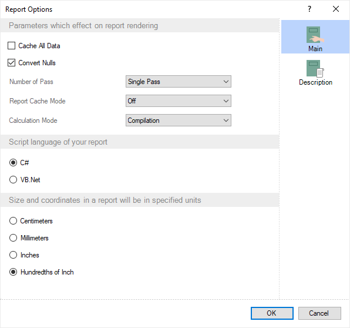

## Report Template

Attention

Scripts can pose a security risk. Therefore, [colculation mode](Calculation_Mode.md) are disabled in Interpretation mode. If you are confident in the security of the scripts, you can use them in Compilation mode.

A report or dashboard is a way of processing data presented by any structure. The report engine processes the data of the report or dashboard, and its structure is created in the report template. A report template is an area in the report designer in which a report structure or analytical panel is created using components or elements, respectively.
You can create the structure, a position of components or elements:

* On a page or form if you design a report;

* On the dashboard panel, if you create a [dashboard](../../Dashboards/index.md).

The report template has its settings that affect both the process of building a report or dashboard and its result. For example, in the properties of a report template, the expression processing mode is determined - compilation or interpretation. Also, using the settings of the report template, you can configure the preview panel, report update time, report culture, and more.
The following ways exit to change the report template settings:

* Click on the report template area (outside the page or dashboard), and set the property values on the Property panel in the report designer.

* Double-click the left mouse button in the report template area (outside the page or dashboard) to call the Report Options window.

> **Information**
>
> The Report Options window contains duplicate properties of the report template. A complete list is provided on the Property panel.

The table below shows the properties of the report template.

Name

Description

Report Name

It is used to change the name of the report.

Report Alias

It is used to change the report alias.

Report Author

It is used to change the author of the report.

Report Description

It is used to change the description of the report.

Report Image

It is used to upload an image that will be a thumbnail for the current report.

Auto Localize Report on Run

It is used to enable the automatic localization of strings. [Learn more](Globalization_Editor.md) about this in this section.

Cache All Data

It is used to enable or disable the caching mode of all data in one DataSet. If the property is set to True, then all data will be cached in one DataSet. If the property is set to False, then all data will not be cached in one DataSet.

Cache Totals

It is used to enable or disable caching of totals with the Totals prefix. If the property is set to True, the totals will be cached. If the property is set to False, the totals will not be cached.

Calculation Mode

It is used to determine the processing mode of report expressions - Compilation or Interpretation. [Learn more](Calculation_Mode.md) about this in this section.

Convert Nulls

It is used to convert null to default values, for numerical values - to zero. If the property is set to True and the data column type containing null is not Nullable, all null values will be converted to default values. If the property is set to False, null values will not be converted.

Collate

It is used to shuffle the pages of a rendered report. If the property is set to greater than 1, then all pages of the rendered report will be split into groups, and then one page from each group will be sequentially added to the new page collection. If the property is set to 1, then the report pages will not be shuffled.

Culture

It is used to change the report culture. You can [learn more about the report culture](Report_Culture.md) in this section.

Engine Version

It is used to select the version of the report engine that will be used to build reports.

Globalization Strings

It is used to customize globalization strings in a report. Click the Browse button in the value field to open the [Globalization editor](Globalization_Editor.md).

Number of Pass

It is used to select the number of passes when rendering the report - Single Pass, Double Pass.

Preview Mode

It is used to define the preview mode – [Standard](../../Viewer/Reports/index.md), Standard and Dot-Matrix, and [Dot-Matrix](../../Viewer/Reports/Dot-Matrix_Mode.md).

Preview Settings

It is used to customize the preview panel of reports and dashboards. Click the Browse button in the value field to open the [preview settings editor](Preview_Settings.md).

Printer Settings

A group of properties that is used to specify print settings - select a printer, set the duplex mode, determine the number of copies, etc.

Referenced Assemblies

It is used to edit the list of used assemblies. Click the Browse button in the value field to open the row collection editor, in which you must add or remove the necessary assemblies.

Refresh Time

It is used to determine the time of rebuilding a report or dashboard. You can [learn more about the refresh time](Refresh_Time.md) in this chapter.

Report Cache Mode

It is used to choose the mode of report caching. The next values are available On, Off, and Auto. If the current property is set to Auto, the report caching will be activated automatically if the number of report pages is more than 200.

Report Unit

It is used to select the units in the report- Centimeters, Inches, Hundredths, and Millimeters.

Retrieve Only Used Data

It is used to request only the necessary data or all dictionary data. You can [learn more about requesting only the necessary data](Retrieve_Only_Used_Data.md) in this chapter.

Parameters Orientation

It is used to select the orientation of the toolbox panel when viewing a report - Vertical or Horizontal.

Request Parameters

It is used to request input parameters before rendering a report. If the property is set to True, you should enter the parameters before building the report. If the property is set to False, then it is not required to enter parameters before building the report.

Script Language

It is used to choose a scripting language - CSharp or VB.NET.

Stop Before Page

It is used to stop render a report when it reaches a specific page. The numerical value is indicated in the value field of this property. This value is the serial number of the page of the rendered report, after which the report rendering will be stopped. By default, the property is set to 0, which means that there are no restrictions on the number of pages of the rendered report. The entire report will be built.

Styles

It is used to call a style designer. Click the Browse button in the value field to call the Style Designer.
