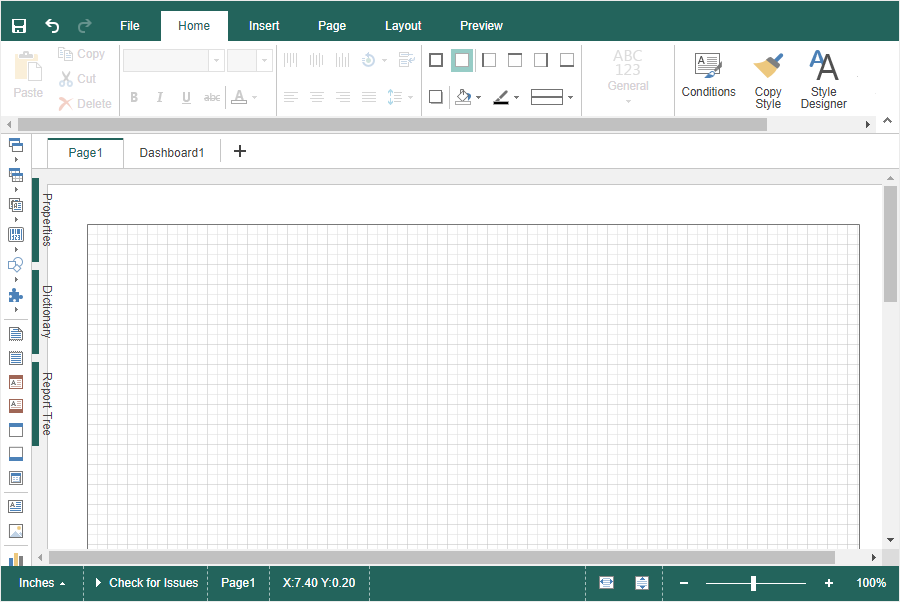
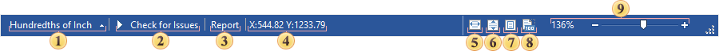
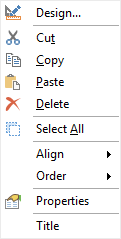
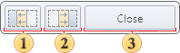
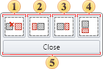

## Report Designer

> **Information**
>
> The report designer supports the execution of various commands when pressing keys or key combinations. For more details, you can refer to the chapter on [hotkeys](Hot_Keys.md), which provides a comprehensive list of available shortcuts.

The Report Designer is a standalone application that is part of the Stimulsoft Reports product. This application is designed for creating, modifying, and publishing reports and dashboards. The designer's interface provides users with a vast set of tools, components, elements, and features for report and dashboard development, visual styling, and previewing. The Ribbon interface of the Report Designer is based on tabbed navigation. Commands and tools are grouped into tabs, reducing the number of toolbars displayed simultaneously in the designer window.

The key elements of the Report Designer interface include:

* Ribbon panel with tabs: [Home](Home_Tab.md), [Insert](Insert_Tab.md), [Page](Page_Tab.md), [Layout](Layout_Tab.md), [Preview](File_Menu/Preview.md);

* [File menu](File_Menu/index.md);

* Panels: [Properties](Panels.md), [Data dictionary](Panels.md), [Tree](Panels.md), [Toolbox](Insert_Tab.md#Toolbox);

* Report template;

* [Status bar](#StatusBar);

Additionally, the report designer includes:
* [Context menu]() for components or elements;

* [Component layout wizard](#PlacementWizard);
* [Component drag-and-drop wizard](#DragAndDropWizard).

Status Bar

The Status Bar is located at the bottom of the Report Designer window and contains various control elements and commands.

 A control element that allows users to change the measurement units in the report. Clicking on it displays a list of available measurement units;

 A command to initiate a report check. More details about the report inspector can be found in the [corresponding section](File_Menu/Info.md#ReportChecker);

 A field displaying the name of the selected component or element;

 A field showing the cursor coordinates on the report template page or dashboard, as well as the coordinates and dimensions of the selected component or element. The coordinate origin (X:0,0 and Y:0,0) corresponds to the top-left corner of the component or element;

 A command to set the zoom level so that the report page or dashboard fits the width of the report template area;

 A command to set the zoom level so that the report page or dashboard fits the height of the report template area;

 A command to set the zoom level so that the report page or dashboard fits both width and height within the report template area;
 A command to set the zoom level to 100% for the report page or dashboard;

 A control element for adjusting the zoom level of the report page or dashboard;

Context menu

The Context Menu is a menu that appears when the secondary button of an input device is clicked. This menu displays duplicate commands for managing the component or element under the cursor at the time of the menu activation. The availability and content of the context menu depend on the type of component or element.

Components placement wizard

When dragging components from the dictionary, toolbox, or any other container onto bands in the report template, if the component's boundaries extend beyond the band’s borders, the Components Placement Wizard will be triggered. This wizard allows users to define the placement of the component within the current band.

 Moves the component to the left side of the free space, stretching it vertically to fill the available height;

 Moves the component to the right side of the free space, stretching it vertically to fill the available height;

 Closes the Components Placement Wizard window.

Drag-and-Drop Wizard

When one text component is placed over another, the Drag & Drop Wizard is activated. This wizard allows users to choose how to arrange the content of the two components.

 Replaces the expression in the text component originally in the report template with the expression from the dragged text component;

 Inserts the expression from the dragged text component before the expression of the current component;

 Inserts the expression from the dragged text component after the expression of the current component;

 Inserts the expression from the dragged text component after the expression of the current component, on a new line;

 The Close button closes the Drag & Drop Wizard window.
