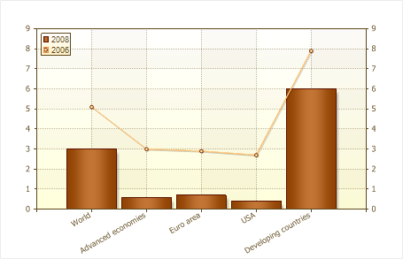
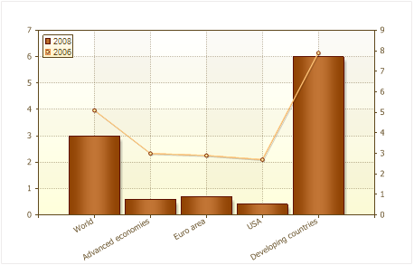
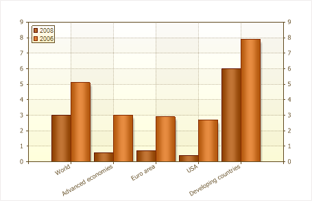
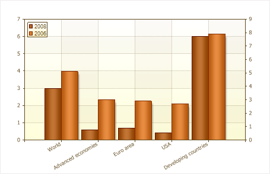

## Axis Y

For each row, you can choose left or right axis Y, which is about the plot. Attachment to the axis of the graph depends on the properties of a number of axis Y (Axis Y), depending on the value of this property and are binding. If this property is set to Left axis Y (Left Y Axis), it will bind to the left axis, and if the property is set to the right axis Y (Right Y Axis) - to the right. Typically, this feature is used when you want to display a chart of different types of series. Let us consider in more detail with an example. We construct a diagram that will contain data on global economic growth for 2006 and 2008. Data for the 2008th displayed as a histogram, and in 2006 as a line. Chart datum, in this case, leave the default, ie to the left axis Y. The figure below shows a diagram constructed:

As can be seen from the picture, in general, global economic growth by region for 2006 was higher than in 2008. In this case, the report generator will generate the left Y-axis by choosing the maximum value of the columns of data in those rows that are tied to it, ie, from the column data in bar charts and line. And then, build graphs for the axis Y. If the right Y-axis is enabled, the value of this axis will be duplicated on the left axis Y. Now change the example slightly, we establish a number of anchor line (Line) to the right Y-axis and construct a graph. The picture below shows a diagram with reference to the right and left axis Y, different series:

As can be seen from the picture, the value and dynamics of global economic growth have not changed. But the values ​​of the left and right Y-axis are not identical. In this case, a report generator built on the left Y-axis maximum value from a column of data series that is tied to the left axis, ie by the maximum value from the histogram and the right axis Y - by the maximum value at the line. It is also worth noting that you can specify a different axis, and for the series of the same type. The picture below shows two diagrams (on the left - both series are tied to the left axis Y, on the right - first row to the left axis, the second - to the right):

As can be seen on the diagram, where the binding is to a single axis, it is better visible the dynamics of growth (or loss), but at the same time, if the values ​​of one series would be great, and the second is considerably small, should be used to bind to different axes. This will enable even the smallest value to visualize. Also, it should be understood that the rows of stacked rows of binding to different axes Y is incorrect, because This contradicts the method of charting the accumulation.
