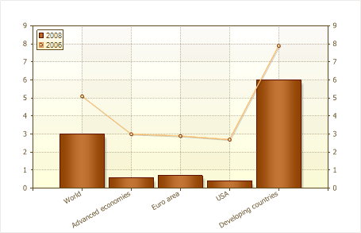
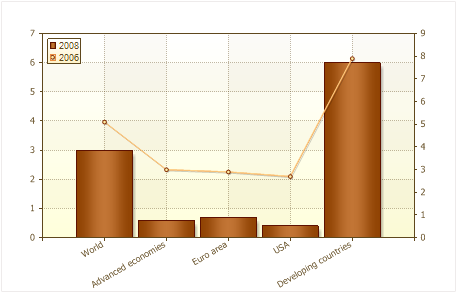
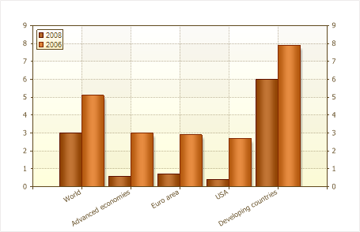
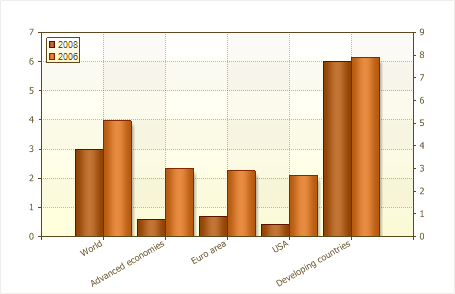

# Axis Y

For each series, you can choose the left or right Y-axis to bind it to. The axis a series is attached to depends on the value of its Axis Y property: if this property is set to Left Y Axis, the series is bound to the left axis, and if it is set to Right Y Axis, the series is bound to the right axis. This feature is typically used when you want to display a chart with different types of series. Let's look at this in more detail with an example. We will build a chart containing data on global economic growth for 2006 and 2008. The data for 2008 is displayed as a bar chart, and the data for 2006 as a line. In this example, we leave the Axis Y property at its default value, i.e. the left Y-axis. The figure below shows the resulting chart:

As you can see from the picture, global economic growth by region was, overall, higher in 2006 than in 2008. In this case, the report engine builds the left Y-axis by taking the maximum value among the series bound to it - that is, from both the bar chart and the line series data - and then plots both series against that axis. If the right Y-axis is not used, its values simply duplicate the left Y-axis. Now let's change the example slightly: we bind the Line series to the right Y-axis instead and rebuild the chart. The picture below shows a chart where different series are bound to the right and left Y-axes:

As you can see from the picture, the values and dynamics of global economic growth have not changed, but the scales of the left and right Y-axes are no longer identical. In this case, the report engine builds the left Y-axis using the maximum value of the series bound to it - i.e., the maximum value from the bar chart - and the right Y-axis using the maximum value of the line series. It is also worth noting that you can bind series to different axes even when they are of the same type. The picture below shows two charts (on the left, both series are bound to the left Y-axis; on the right, the first series is bound to the left axis and the second to the right axis):

As you can see, in the chart where both series are bound to a single axis, the dynamics of growth (or decline) are more clearly visible. However, if the values of one series are much larger than the other, it is better to bind the series to different axes - this makes it possible to visualize even the smallest values. It is also worth noting that binding stacked series to different Y-axes is incorrect, since this contradicts the way accumulation is charted.
