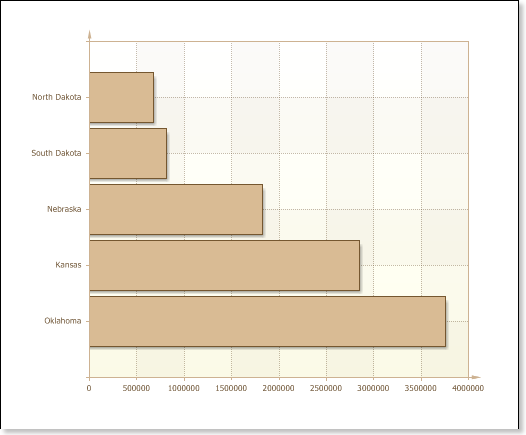
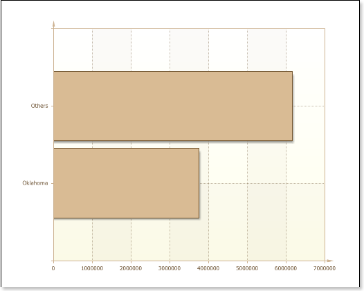
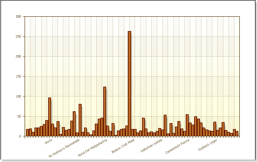
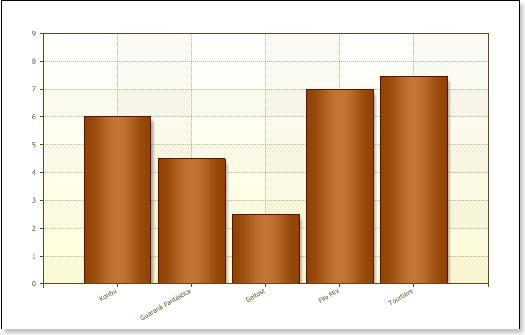

## Top N

Using the group of properties Top N you may highlight the maximum or minimum values ​​in the chart, and the rest one group into a single value. Grouped value is a sum of all values ​​that were not identified. Features offered by the group of properties Top N, can be applied in different cases: when the chart has many values but it is needed to allocate a certain amount of the maximum (minimum) ones or, for example, if you want the chart to display the difference between the maximum (minimum) values and set other values​​. Let's consider the properties of Top N in more detail.

1. The **Count** property provides the ability to determine the number of values ​​that will be displayed and will not be subject of grouping. If this property is set to 2, then it means that the two maximum (minimum) values will be displayed, and the rest are grouped into a single value.

2. Depending on the value of **Mode** property will be allocated the maximum or minimum values. If the **Mode** property mode is set to **Top**, the maximum values ​​will be highlighted, and if the property is set to Bottom - the minimum ones will be selected. If the **Mode** property is set to **None**, then all the values ​​in the fields of the properties **List of Value**​, or **Value Data Column** will be displayed.

3. Specify the signature of the argument values ​​grouped, you can use the properties of the Other Text. If the field is empty for this property, the signature of the argument have grouped the values ​​will be absent.

4. Displaying or not hiding the grouped property value provides an opportunity to Show Other. If this property is set to true (true), then this value is shown in the diagram, and if the value lies in the (false) - a group the values ​​are not displayed.

Consider the possibilities offered by a group of Top N properties as an example. There is a report that plotted on the population in some states of America. The picture below shows this diagram:

As you can see from the picture, the population of Oklahoma is the largest in the diagram. For example, to visually display the differences in the population of Oklahoma and the total population of other states in this diagram. Define the property values ​​of Top N. Since it is necessary to allocate a single maximum value (population of Oklahoma), the number of property (Count) should be set to 1, and the **Mode** property - is set to Top. If you want you can add a signature argument of the aggregate value. In this example, the property Other Text define to be the Other. Show Other property also must be set to true (true), as in this example, the goal is to visually display the differences between populations in Oklahoma and other states in this diagram. The picture below shows a diagram with the properties of the applied group Top N:

As can be seen from the picture, the other values ​​were grouped into a single value with the signature of an argument Other. Out of the diagram shows that the total population exceeds the population of the four states of Oklahoma. Consider another example. There is a chart with a set of values, in this case the products and their prices. The picture below shows a diagram:

As the picture shows, visually, this picture is seen with difficulty, and select the maximum (minimum) value is problematic. In this example, we select 5 products to the most minimal prices. To do this, set the **Count** property in the value 5, the **Mode** property - is set to Bottom, Other Text property field is left blank, because the property is set to Show Other value **false**. The picture below shows a diagram with the properties of the applied group Top N:

As can be seen from the picture, a kind of filtering is performed, ie Report Generator has identified five minimum values​​, and the rest grouped into a single value. Because the property found in the Show Other value lies (false), then grouped the value does not appear on this chart.
