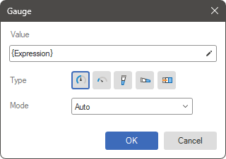

## Gauge editor

The configuration of a gauge is performed in its editor. The gauge editor in reports can be:

* **Advanced** allows for element-by-element configuration of the component. It requires a deep understanding of gauges. This type of editor is available only in Stimulsoft Designer for WinForms.

* **Simple** provides a quick and easy way to add a component to a report and use it for data display and analysis.

Switching between editor modes is done in the **Options** menu of the report designer using the **Gauge Editor** option. By default, the simple editor is used. Below is a description of the simple editor for the **Gauge** **component**.

* The **Value** field allows you to specify a value for the gauge or an expression whose calculation result will serve as the value for this component.

* The **Type** parameter allows you to change the type of the gauge.

* The **Mode** parameter allows you to change the calculation mode for the gauge's value range.
