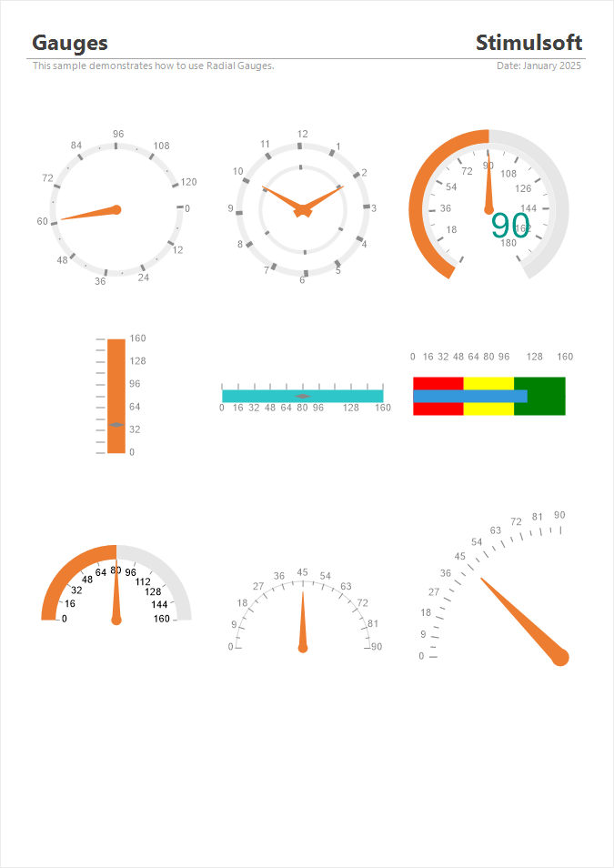

## Gauge

**Gauge** is a graphical component used to display progress, metrics, or status in the form of a scale or circular.

**Gauges in reports can be used to display:**

* Progress measurement: the degree of task or plan completion, such as 75% of a project being finished.

* Performance evaluation: display current KPIs (Key Performance Indicators), such as revenue, productivity, or quality, in relation to target values.

* Status monitoring: track the state of systems or resources, such as CPU usage, memory load, etc.

Gauges can be of the following types:
* **Full Circular**;

* **Half-Circular**;
* **Vertical Linear**;

* **Horizontal Linear**;

* **Bullet**.

