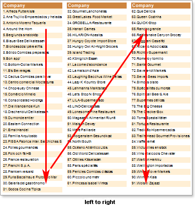
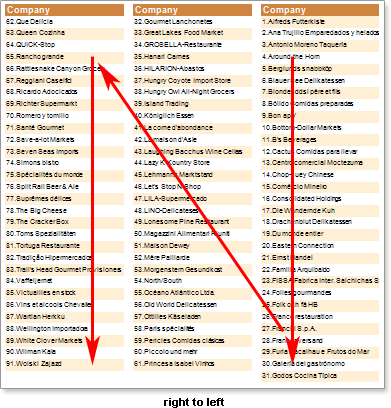
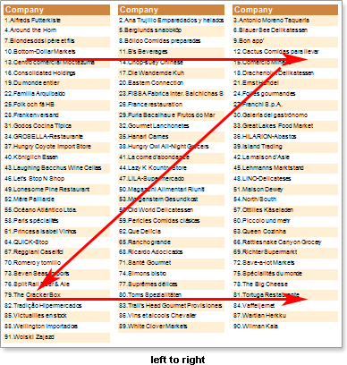

## Columns in Data Band

**"Down Then Right" direction**

In this direction the reporting tool tries equally to distribute all rows between columns. Then, after distribution rows between columns, the first column is output. And the column is not output to the end of a page, but until the number of elements that are distributed for this column. Then the second column is output. So the data take as much space on the page as it is required. So data will be distributed approximately equally among all the columns. And all data will be presented on a sheet in a convenient form. The mode of showing columns depends on the value of the **RightToLeft**  property of the **DataBand**. If the **RightToLeft** property is set to **false**, then columns on the report page will be displayed from left to right. If the **RightToLeft** property is set to **true**, then the column on the report page will be displayed from right to left. The picture below shows examples of two modes of showing columns on report pages:

**"Right Then Down" direction**

In this direction lines are sequentially output in the **Data Band**. By default the mode of output is left to right. Row are displayed - one line in one column. When all rows are displayed in columns in the **Data Band**, a new Data Band is created and it again displays all the rows in columns. So, the data will take as much space on the page as it is required. The mode of showing columns depends on the value of the **RightToLeft**  property of the **DataBand**. If the **RightToLeft** property is set to **false**, then columns on the report page will be displayed from left to right. If the **RightToLeft** property is set to **true**, then the column on the report page will be displayed from right to left. The picture below shows examples of two modes of showing columns on report pages:

