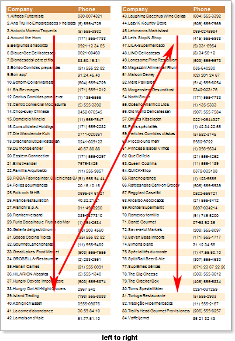
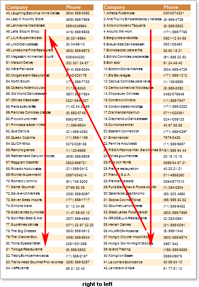

## Columns on Page

Stimulsoft Reports prints bands until there is a free space on a page. Then, instead of creating a new page, the reporting tool adds a new column on the right. Then it prints data from the top of a page. This happens until all data are printed and page will be exhausted. The columns direction is always from top to bottom, and a mode of showing columns can be different. there are two modes: "left to right" and "right to left". The mode of showing columns on a page depends on the value of the RightToLeft property of a page. If the RightToLeft property is set to false, then columns will be output in the "left to right" mode. If this property of a page is set to true, then columns will be output in the "right to left" mode. The picture below shows columns on a page output in two modes:

