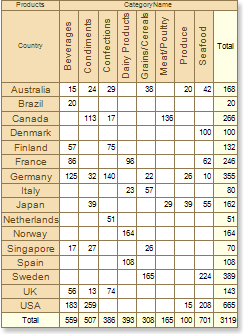
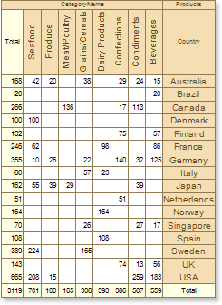

## Cross Table Component

The cross table component has the **RightToLeft** property, that allows showing a cross-table in the right-to-left mode. If the **RightToLeft** property is set to **false**, then the cross table is rendered in the "left-to-right" mode. The picture below shows a cross table sample with the **RightToLeft** property set to **false**:

If the **RightToLeft** property of a cross table is set to **true**, then the cross table is output in the "right-to-left" mode. The picture below shows a cross table sample with the **RightToLeft** property set to **true**:

By default, the **RightToLeft** property of the cross table is set to **false**, this means that the cross table is output from left to right.
