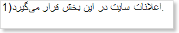
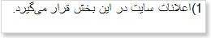

## Text Component

How the text will be output depends on the **RightToLeft** property. If it is set to **false**, then a text (all symbols except letters) is output from left to right. The picture below shows a text sample in Arabic that is output from left to right:

If the **RightToLeft** property is set to **true**, then a text is output from right to left. The picture below shows a text sample in Arabic that is output from right to left:

In any case a text written in a right-to-left language will be output right to left.
