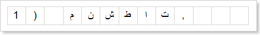
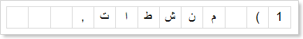
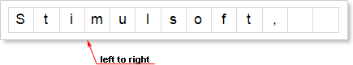
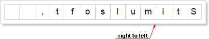

## Text In Cells Component

A text in cells is placed symbol-by-symbol (one symbol or a space - one cell). How the text will be output depends on the **RightToLeft** property. If it is set to **false**, then a text is output from left to right. The picture below shows a text sample in Arabic that is output from left to right:

If the **RightToLeft** property is set to **true**, then a text is output from left to right. The picture below shows a text sample in Arabic that is output from right to left:

The **RightToLeft** property of the **Text in Cells** component works the same way with all languages. So a text characters and sy6mbols will be output from left to right or from right to right depending on the value of this property. The picture below shows a text output in "left to right" (the first picture) and right to left (second picture) modes:

The **RightToLeft** property depends on the **Continuous Text** property. If the **Continuous Text** property is set to **true**, then the **RightToLeft** property will not work. In other words, a text will be output from left to right regardless the **RightToLeft** property. If the **Continuous Text** property is set to **false**, then the text direction will depend on the value of the **RightToLeft** property.
