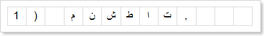
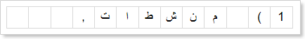
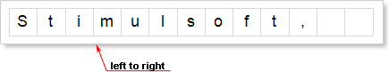
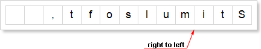

## Text In Cells Component

A text in cells is placed symbol-by-symbol (one symbol or a space - one cell). How the text will be output depends on the **RightToLeft** property. If it is set to **false**, then a text is output from left to right. The picture below shows a text sample in Arabic that is output from left to right:

If the **RightToLeft** property is set to **true**, text is displayed from right to left. The image below shows an Arabic text sample displayed from right to left:

The **RightToLeft** property works the same way for all languages in the **Text in Cells** component. Depending on its value, characters and symbols are displayed either from left to right or from right to left. The images below show text displayed in left-to-right (first image) and right-to-left (second image) modes:

The **RightToLeft** property depends on the **Continuous Text** property. If **Continuous Text** is set to **true**, the **RightToLeft** property has no effect. In this case, text is always displayed from left to right. If **Continuous Text** is set to **false**, the text direction is determined by the **RightToLeft** property.
