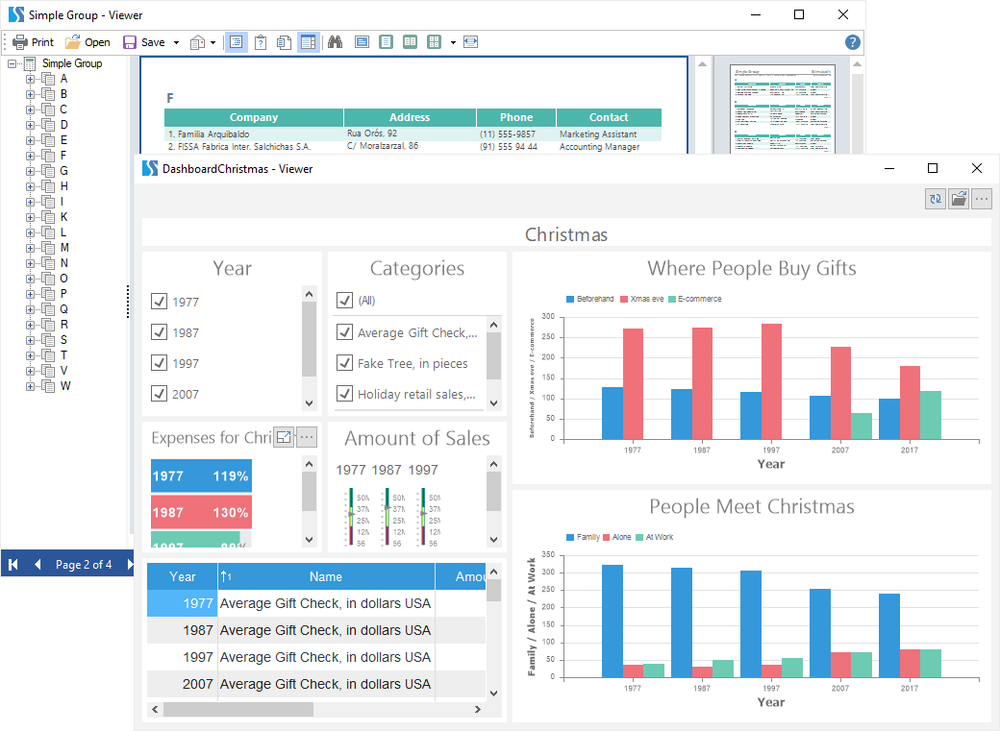

## Viewers

A report viewer is a tool that is used to view, print, export reports and dashboards. In this section, you can find:

* With the [viewer functionality](Features.md);

* With the list of [export formats in the viewer](Exports.md).

