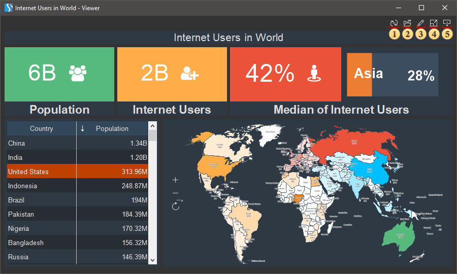
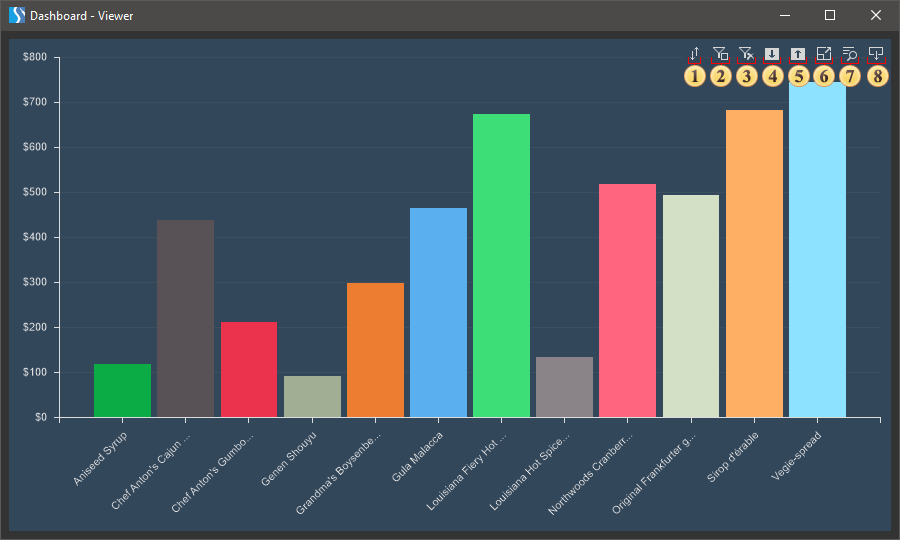

## Dashboards

The report viewer in the view mode for dashboard panels differs from the report viewer in the report view mode. The dashboard panel and its elements are stretched to the entire area of the viewer. Elements of the dashboard panel - [Combo Box](../Dashboards/Data_Filtering/Combo_Box.md), [Date Picker](../Dashboards/Data_Filtering/Date_Picker.md), [Tree View Box](../Dashboards/Data_Filtering/Tree_View_Box.md) are stretched only in width. Besides, the dashboard and its elements contain various control buttons.

Control buttons of the dashboard

Controls of the dashboard are located in the upper right corner above the dashboard panel.

 The Refresh button is used to update the dashboard.

 The Open button is used to open a previously saved report file.

> **Information**
>
> A report file may contain the following: only a report, only a dashboard, and both a report and a dashboard.
>
>
> If the report file contains only the report, then this report will be rendered and displayed in the report viewer.
>
> If the report file contains only the dashboard, then the report viewer will switch to the view mode of the dashboard, with the display of this panel.
>
> If the report file contains a report and dashboard, then the report viewer will switch to the view mode of the dashboard with this panel displayed. To view a report, in the report viewer window, go to the tab with the name of the report template page.

 The Edit button is used to change the rendered dashboard in the report designer. You should know that this can only be done if, before rendering the dashboard panel, the Calculation Mode property of the template is set to Interpretation.

 The Full Screen button is used to view the dashboard in the full-screen mode. To exit this mode, you can use the Esc or Alt+F4 hot keys.

 The Save button invokes a menu with various commands for controlling the dashboard panel. For example, [these are commands to convert the dashboard](../Exports/Dashboards.md) to other files - PDF, Excel, and PNG.

Element controls

The control buttons of the dashboard elements are located in the upper right corner of the area of this element and are displayed when you hover over or select this element.

 The Sort button calls a menu to define the data column and the sorting direction for the values of the current element of the dashboard panel.

 This button is used to enable or disable the filtering mode for several segments.

  * If this button is enabled, then to filter data, you can select several segments on one element of the dashboard.

  * If the button is disabled, then when selecting the next segment, the previous filter will be reset.

For example, when filtering by map, in the single mode, when you click on each segment, other elements of the dashboard panel will only display related data with the current map segment. In the filtering mode by several segments, other elements of the dashboard will display the associated data with all selected segments of the map.

 This button is used to delete all filters. When clicking it, all filters of the current element of the dashboard will be deleted.

> **Information**
>
> The filtering control buttons are present only in the dashboard elements that have active segments for filtering data - [Table](../Dashboards/Table.md), [Chart](../Dashboards/Chart.md), and [Region Map](../Dashboards/Maps/Region_Map.md).

 This button is used to switch to the lower level of the drill-down of an element. This button is only displayed if the drill-down mode for the element is enabled.

 This button is used to go to the upper level of the drill-down of the element. This button is only displayed if the drill-down mode for the element is enabled.

 The Full Screen button is used to display a specific element of the dashboard over the entire area of the viewer.

 The View Data button. When you click on this button, a window with the data used in the current element of the dashboard will be called.

 The Save button invokes a menu with various control commands for a specific element of the dashboard. For example, commands to convert the current element of the dashboard to other files - PDF, Excel, and PNG.

> **Information**
>
> You should know that you can enable or disable displaying of the Sort, Save, View Data and Full Screen buttons in the viewer or on the preview tab. Select the element in the report designer, click the Interaction button on the Home tab of the Ribbon panel, and enable (or disable) the check box for the parameters if you want to display (or not display) the buttons of the element.
