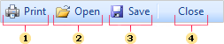
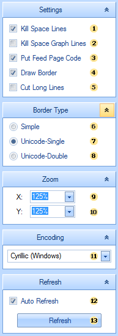

## Dot-Matrix

The Dot-Matrix viewer is designed to preview the report before printing it on a dot matrix printer. The Dot matrix printer is used to print only the text and characters of pseudographics. Accordingly, the viewer displays only the text and borders of objects as pseudographics characters.
**Toolbar**

The picture below shows the toolbar of the Dot-matrix viewer:

 Prints the report. After activation of this command the Print dialog will be displayed, where you will be asked to select printing options.

 Opens a previously saved text file.

 Saves the rendered report to a text file.

 Closes the Dot-matrix viewer dialog box.

**Bar Options**

The Options bar is grouped, and each group is located on a separate tab. The picture below shows the options bar:

  The **Kill Space Lines** option removes empty rows in the text.

  The **Kill Space Graph Lines** option deletes the rows that contain only the "vertical line" pseudographics characters.

  The **Put Feed Page Code** option inserts the FormFeed symbol on the bottom of each page.

  The **Draw Border** option draws the borders of the objects of the selected type.

  The **Cut Long Lines** option cuts long lines of the text that is out of bounds of the text component.

 -  options are the parameters of the border and define its type:

  **Simple** border is drawn with + - | symbols and will be saved and printed in any encoding;

  **Unicode-Single** single lines of pseudographics are used;

  **Unicode-Double** double lines of pseudographics are used;

Pseudographics characters are not present in each encoding.

 -  options. When exporting to text all the coordinates and sizes of objects are recalculated. Zoom **X** and Zoom **Y** coefficients control this conversion.

By default, Zoom **X** = 100%, Zoom **Y** = 100%. With these values of the parameter, the A4 page is converted to text with sizes of 80 characters by width and 62 rows by height.

This corresponds to using the **Pica** font of the printer (80 characters per line) and the line spacing **1,0**. The following values are frequently used:

* Zoom **X** = 100% corresponds to using the Pica font of the printer (80 characters per line);

* Zoom **X** = 120% corresponds to using the Elite font of the printer (96 characters per line);

* Zoom **X** = 170% corresponds to using the condensed font of the printer (136 characters per line);

* Zoom **Y** = 100% corresponds to the using the line spacing 1,0.

 Scale by the X-axis (Zoom X:), by page width.

 Scale by the Y-axis (Zoom Y:), by page height.

 Encoding is the encoding of the displayed text.

 The **Auto Refresh** parameter automatically updates the rendered report if there are any changes were applied to the settings.

 The **Refresh** button is used to update the rendered report manually.
