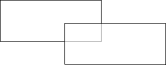
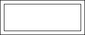

## Special Viewing Options in Web

Recommendations on Placing Components on Page

How the StiWebViewer helps to view a report? To view a report the StiWebViewer exports it to the HTML format. This HTML text is output in the part of the StiWebViewer that is used to show reports. The HTML file is formed as one big table. The output is done in the HTML format do there are some limitations when report rendering. Stimulsoft Reports stores all objects separately but not as a table. When converting a report to the HTML format, the edges of the objects may be intersected. Such intersections may lead to the incorrect output of a report in the browser, though the report generator tries to output a report correctly with overlapping objects. Therefore, it is better not to overlap objects. Examples of components overlapping are shown in the picture below.

When report rendering, it is better use the grid. It allows placing objects by the grid and getting correct viewing a report in the browser.

Using Graphic Objects in Report

Stimulsoft Reports offers a full set of graphic objects. The following graphic objects are used in web:

* Images;

* Charts;

* Graphic primitives (the Shape component);

* Bar-codes;

* RTF text;

* CheckBox.

The Vertical Line, Horizontal Line, Rectangle components are not graphic objects.  Also, it is important to consider that vector images (WMF, EMF, EMF+) are not supported by the HTML format. So they will be converted to images in the pixel format.

> **Information**
>
> All text components which contain text are rotated (the value of the Angle property is not 0) and converted to images. Besides, if the ExportAsImage property is set to true, then the text components will also be converted to the image.

All components are joined with one rule - all of them will be converted as images. The HTML format does not allow passing an image in its body, and the report generator uses the cache of a page or the cache of a session for saving images. When a huge amount of calling to a report and multiple images in a report, there can be huge amount of objects in the page cache or in the session cache. And these objects will take additional server memory. Therefore, it is better not to use many graphic objects. Using the ServerTimeOut property can be used to set the time of objects caching in the page cache or in the session cache.

> **Information**
>
> HTML supports some formats of showing images (JPEG, PNG, BMP, and GIF). It is possible to set the image type using the ImageFormat property of the StiWebViewer component. Every type of image has its own advantages and disadvantages.

Displaying Images Placed on Server

If an image that should be output is static and can be saved on the server, then it is recommended to use the ImagerUrl property of the Image component for showing images. When using this property, the report generator does not save the image in the cache of a page or the cache of a session but puts a link on this image. So the report generator saves nothing in the cache of a page or the cache of a session, and the server memory is not used for this.

Printing Reports

It is difficult to print a report from the browser. Stimulsoft Reports has three methods of printing:

* Converting a report to the PDF file and passing it to the end-user for printing.

* Printing a report with preview in the pop-up window.

* Printing without preview.

The first method is the best way. It allows printing a report more precisely. But it is required to have installed Adobe Acrobat to print a report to the PDF format. Often this requirement is a big disadvantage. When printing reports with preview the report generator creates a new pop-up window. A report in the HTML format is output in this window. The end-user may format this report and print it. In printing reports without preview the report generator prints a report without preview. When choosing the method of printing characteristics of each method should be considered.

> **Information**
>
> The StiWebViewer component cannot control page parameters (page size, page orientation, page margins) when printing using the 2 and 3 methods. All parameters are controlled with the browser.
