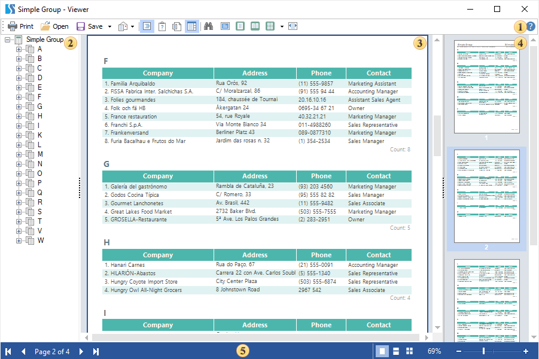
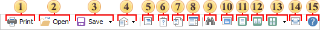
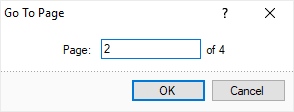
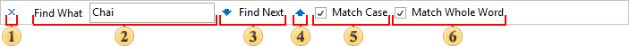
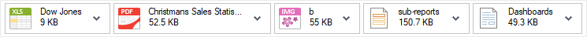

## Reports

This chapter will cover the following:

* [Viewer Structure](#viewerstructure);

* [Viewer Toolbar](#toolbar);

* [Viewer Status Bar](#statusbar);

* [Displaying Mode](#displayingmode)**;**

* [Search Panel](#searchpanel)**;**

* [Resources Panel](#resourcespanel)**;**

* [Sending Report via E-Mail](#sendingreportviaemail);
* [Exporting Report](#exportingreport)**;**
* [Shortcuts](#shortcuts)**.**

**Viewer Structure**
On the picture below you may find the basic elements of the report viewer.

 This panel contains menus which have the basic control commands of the report viewer.

 The tree of bookmarks of the output report. Using these bookmarks you can navigate through structure elements of a report.

 The area where the report is shown.

 The report thumbnails panel. Decreased copies of report pages are shown on this panel. The panel is used to quickly navigate throughout a report.

 The status bar of viewer.

**Toolbar**

The main toolbar locates commands to control the report. Below is the structure of the toolbar with the description of each command.

 Print a report. After activation of this command the printing dialog with parameters of printing will be displayed.

 Open previously saved report. Any rendered report can be saved to .mdc or .mdz format for further preview.

> **Information**
>
> A report file may contain only a report; only a dashboard; both a report and a dashboard.
>
>
> * If the report file contains only the report, then this report will be rendered and displayed in the report viewer.
>
> * If the report file contains only the dashboard, then the report viewer will switch to the view mode of the dashboard, with the display of this panel.
>
> * If the report file contains both the report and the dashboard, then the report viewer will switch to the view mode of the dashboard, with the display of this panel. To view the report, go to the tab with the name of the report page.

 [Save the rendered report](#exportingreport) to other file formats.

 [Send the render report](#sendingreportviaemail) via Email. The report will be converted to one of the file formats.

 Show/hide the tree of bookmarks. If there are no bookmarks in the rendered report then the viewer will automatically hide the tree of bookmarks. If there are bookmarks in a report, then the viewer will automatically show the tree of bookmarks.

 Opens the dialog for changing the basic parameters of the rendered report.

 The Resources button. With this button, you can enable or disable the [resource panel](#resourcespanel) in the viewer. If the report does not contain resources that can be displayed in the viewer, this button will be disabled.

 Show/hide the thumbnails of reports.

 Enable the [search panel](#searchpanel).

 Run the full-screen mode of report showing. To exit this mode, you can use the Esc or Alt+F4 hot keys.

 Change zoom of the report to display only one full page. More than one page by the width can be output.

 The Two Pages button is used the zoom the report so that two pages could fit the viewer window by height.

 The Multiple Pages button is used to call a menu in which you can select the number of pages by width and height.

 Change the zoom of the report to fit the page width to the screen width.

 The button is used to open the user manual page.

> **Information**
>
> In addition to the above commands, other buttons may be displayed on the toolbar:
>
>
> * If the report contains editable fields, the **Editor** button will be displayed in the viewer. When you click this button, the edit mode of the report components will be activated.
>
> * Commands are used to create, edit, delete, and customize pages of the rendered report.
>
> * The **Close** button is used to close the preview tab or viewer window.
>
> * The button is used to enable the [Dot-matrix mode](Dot-Matrix_Mode.md).

**Status Bar**

The status panel contains navigation controls in the report, report display modes, and its zoom.

 Set the first page of a report as the current page.

 Set the previous page of a report as the current one.

 Show the number of the current page and the number of pages in a report. If you click on it, then it is possible to indicate the number of a page that should be the current one.

 Set the next page of a report as the current one.

 Set the last page of a report as the current page.

 The buttons are used to switch display modes for pages.

 The zoom control for the report.

**Displaying Mode**

The viewer for WinForms supports three modes of viewing pages:

* 
 Single page. In this mode, the current page of a report is shown in the window of the viewer. The picture below shows how this mode works.

* 
 Continuous. In this mode, all pages are placed into one vertical line. The picture below shows how this mode works.

* 
 Multiple Pages.  In this mode as many pages in the selected zoom as they can fill the window of the viewer are shown. The picture below shows how this mode works.

**Search Panel**

The search panel is used to search for some text in the report. On the main toolbar, this option can be enabled by clicking the binocular icon. All controls for search are placed on a single panel.

 Close the search panel.

 The field to put a text that should be found.

 The button to run the search.

 The button to run the search.

 If the flag is set, then the search will be repeated considering the case.

 If the flag is set, then the search will be done considering the whole word.

**Resources Panel**

You can display some resources which were added to the report in a separate panel in the viewer. To do this, when adding a resource in the report designer, select Available in the Viewer option. Then, click the Resources button in the viewer to display a panel with these resources.

Each resource in this panel can be viewed or saved.

**Sending Report via E-Mail**

Any rendered report can be sent via Email. Send a report via Email following the instruction below.

* The report is exported as a file. The file format is defined by the user in the menu Send Email;

* Then create a new message and attach a file to the Email;

* A dialog of the Email client is open by default, i.e. the wizard for sending Emails is invoked.
**Exporting Report**
Any rendered report can be converted to various formats, for example, to PDF, Excel, Word, etc. Report export has several stages.

* Click the Save button in the viewer;

* Select the type of file you want to convert the report into;

* Set export settings;

* Save the converted file.
See the chapter [Exports](../../Exports/index.md) to get more information about converting a report to other types of files.
**Shortcuts**
The list of keyboard shortcuts in the report viewer is as follows:

| **Shortcut** | **Actions** |
| --- | --- |
| Ctrl+P | Print a report |
| Ctrl+O | Close a report |
| Ctrl+Shift+N | Add a new page to the report |
| Ctrl+Shift+D | Delete the current page of a report |
| Ctrl+Shift+E | Edit the current page of a report in the report designer |
| Ctrl+Shift+S | Change report parameters |
| Ctrl+B | Enable/disable tree of bookmarks |
| Ctrl+T | Enable/disable thumbnails |
| Ctrl+F | Search |
| Ctrl+E | Edit components which support editing |
| F2 | Run the full screen mode of view a report |
| F3 | Set zoom of a report view - one page |
| F4 | Set zoom of a report view - two pages |
| F5 | Set zoom of a report view - by page width |
| Ctrl+G | Jump to page |
| Shift+F2 | Enable the page view mode - one page |
| Shift+F3 | Enable the page view mode - continues |
| Shift+F4 | Enable the page view mode - some pages |
| Esc | The button is used to exit the Full Screen mode. |
| Alt+F4 | The buttons are used to close the window, including the full-screen view. |
